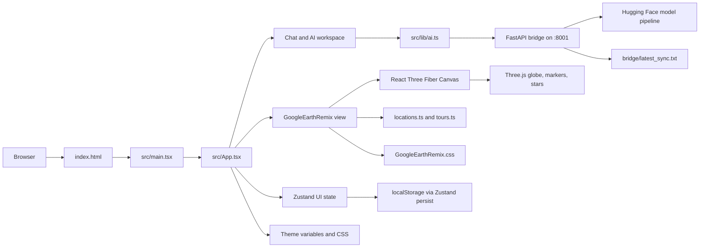

# Silver Wolf VI Code Analysis, Google Earth UI Plan, and Master Prompt

Generated: 2026-05-18
Scope: current workspace at `silver-wolf-vi`
Primary stack: React 19, Vite 6, TypeScript 5.8, Three.js, React Three Fiber, Zustand, FastAPI bridge, archived Phoenix backend.

This document is a practical engineering brief. It explains how the code works together, what each major file takes as input and emits as output, what the project appears to be trying to achieve, the project philosophy, the security and quality risks found in this pass, how to move the interface toward a Google Earth-like experience, and a master prompt for an AI coding agent to implement the changes safely.

## Executive Summary

Silver Wolf VI is currently two products blended together:

1. A cyberpunk local-first AI workspace with chat, settings, telemetry, themes, particles, markdown rendering, and optional local model bridge.
2. A Google Earth-style 3D globe explorer with landmarks, tours, projects, measuring, map styles, mock premium checkout, panorama mode, and a separate standalone Vite project.

The most important improvement is to choose a single app architecture and make the Google Earth-like experience a first-class view instead of a large embedded prototype. The current app builds, but the codebase is carrying duplicated implementations, oversized monolithic components, tracked build-output concerns, hard-coded secrets, permissive local bridge networking, mock payment fields, localStorage secrets, remote assets, and inconsistent module boundaries.

The highest-risk security issue is `bridge/server.py`: it contains a hard-coded Hugging Face token and exposes unauthenticated endpoints with wildcard CORS while binding to `0.0.0.0`. Rotate the token immediately, move secrets to environment variables, restrict CORS to known localhost origins, bind local-only by default, and add request limits.

The highest-impact UI direction is to replace the current left-sidebar HUD with a recognizable Google Earth-like shell: white top menu bar, search pill, horizontal tool strip, full-bleed globe canvas, bottom-left minimap, bottom status strip, bottom-right navigation cluster, and contextual side panels that slide from the left only after a tool is selected.

## Verification Performed

- `node .\node_modules\typescript\bin\tsc --noEmit` from the root app: passed.
- `node .\node_modules\vite\bin\vite.js build` from the root app: passed with a large main chunk warning around 1.28 MB minified.
- `npm audit --json` from the root app: zero known vulnerabilities reported at audit time.
- `node .\node_modules\typescript\bin\tsc --noEmit` from `google-earth-remix`: passed.
- `node .\node_modules\vite\bin\vite.js build` from `google-earth-remix`: passed with a large main chunk warning around 1.20 MB minified.
- `npm audit --json` from `google-earth-remix`: zero known vulnerabilities reported at audit time.
- `python -m py_compile bridge\server.py`: passed.
- `npm run build` from the root app: failed before TypeScript due to Windows command shim/path quoting around the `M365 T&L` path. Direct Node invocation works, so the code can build, but the npm script is brittle on this machine.

## Product Aim

The project aims to create an immersive AI workspace that feels like an operating console: chat-first, visual, local-first, customizable, and spatial. The Google Earth Remix code extends that idea by turning learning and exploration into a 3D planetary interface.

A clearer product statement:

Silver Wolf VI is a local-first AI learning and exploration cockpit. It combines conversational assistance, visual knowledge navigation, system-style feedback, and a 3D Earth interface so the user can explore places, concepts, projects, and AI-generated guidance from one coherent workspace.

## Project Philosophy

- Local-first by default: user settings and chat history stay in the browser unless the user explicitly enables a bridge or connector.
- Immersive but useful: visual polish should support orientation, attention, and repeated use instead of becoming decoration.
- User control: every network call, connector, model, and data sync should be explicit, reversible, and visible.
- Composable architecture: the app should be built from focused modules rather than one massive file.
- Security before spectacle: secrets, bridge endpoints, local files, and connector credentials must be handled as real attack surfaces.
- Earth as a workspace metaphor: the globe should be a navigable canvas for learning, projects, places, tours, context, and memory.
- Faithful interface borrowing, not trademark copying: replicate the interaction skeleton and usability patterns of Google Earth while using original branding, icons, and assets.

## How The Code Works Harmoniously



Runtime flow:

1. `index.html` loads fonts, metadata, a loading state, and `src/main.tsx`.
2. `src/main.tsx` mounts React and renders `src/App.tsx`.
3. `src/App.tsx` currently owns most of the UI, theme tokens, message state, sidebar navigation, floating panels, and the `planetary-link` route.
4. When `planetary-link` is active, `src/components/learning/GoogleEarthRemix.tsx` takes over the main display with a Three.js globe and its own local state.
5. Data for places and tours comes from `src/data/locations.ts` and `src/data/tours.ts`.
6. AI chat calls go through `src/lib/ai.ts`; if `local-assistant` is selected, the browser calls the local FastAPI bridge at `localhost:8001`.
7. The bridge loads a Hugging Face model if Python ML dependencies exist, otherwise returns mock local responses.
8. Zustand persists selected settings in localStorage.
9. CSS variables and Tailwind classes define most visual tokens, while `GoogleEarthRemix.css` defines the globe explorer shell.

## Major Code Inputs And Outputs

| Code | Main inputs | Main outputs and side effects | Purpose |
| --- | --- | --- | --- |
| `index.html` | Browser request, metadata, Google Fonts URL | Loads root div, fonts, favicon, app script | HTML entrypoint and loading shell |
| `src/main.tsx` | DOM `#root`, React `App` | Mounts the React tree | React bootstrapping |
| `src/App.tsx` | Zustand-like local store, user events, timers, theme selections | Main UI, sidebars, panels, chat messages, view switching, CSS variable updates | Current root shell and monolithic app composition |
| `src/store/uiStore.ts` | User settings, chat messages, model choice, Notion fields | Persisted UI state in localStorage | Modular app state store |
| `src/lib/ai.ts` | Model id, user text, system instruction | Fetches bridge responses or simulated AI response | AI transport adapter |
| `src/hooks/useAIChat.ts` | User text and store config | Adds user/AI/system messages, syncs bridge | Chat workflow coordinator |
| `src/components/ChatPanel.tsx` | Store messages, processing flag | Rendered chat timeline and input | Chat interface |
| `src/components/chat/ChatInput.tsx` | User typing and Enter key | Calls `onSend(text)` | Controlled chat input |
| `src/components/chat/ChatMessage.tsx` | Sender and content | Animated message bubble | Chat row presentation |
| `src/components/MarkdownMessage.tsx` | Markdown text | React-rendered markdown, safe links, copyable code blocks | AI response rendering |
| `src/components/SettingsWindow.tsx` | Settings state, drag events | Draggable settings UI | Preferences surface |
| `src/components/settings/AiSettings.tsx` | Model selection and system instruction | Updates AI model and instructions | AI configuration |
| `src/components/settings/NotionSettings.tsx` | Notion enabled flag, API key, database id | Stores connector values in localStorage | Notion configuration UI |
| `src/components/settings/ThemeSettings.tsx` | Palette, wallpaper input | Theme changes, dynamic colors | Appearance settings |
| `src/components/settings/FeedbackSettings.tsx` | Audio and particle toggles | Updates feedback settings | Sensory settings |
| `src/components/SystemMonitor.tsx` | Store metrics, interval ticks | Animated telemetry display and metric updates | Simulated system monitor |
| `src/components/ParticleOverlay.tsx` | Particle toggle, viewport size, worker frames | Canvas particle animation | Ambient visual layer |
| `src/workers/particleWorker.ts` | Init, resize, tick, stop messages | Transferable Float32Array particle frames | Off-main-thread animation math |
| `src/components/layout/BackgroundEarth.tsx` | Remote texture URLs, animation frame | Background 3D Earth and stars | Immersive background layer |
| `src/components/layout/DockedLayout.tsx` | Store layout state | Sidebar, chat, right panel composition | Modular shell layout, currently secondary to monolithic `App` |
| `src/components/layout/SessionSidebar.tsx` | Navigation events, right panel mode | Session controls and view toggles | Sidebar navigation |
| `src/components/layout/TopAppBar.tsx` | Metrics and settings state | Header bar | Modular top bar |
| `src/components/learning/LearningHub.tsx` | Search term and concept data | Filtered concept cards and overlay | Learning library view |
| `src/components/learning/ConceptCard.tsx` | Concept object | Animated concept card | Learning item presentation |
| `src/components/learning/ConceptOverlay.tsx` | Active concept | Modal overlay | Learning detail view |
| `src/components/learning/GoogleEarthRemix.tsx` | User search, tab selection, map settings, locations, tours, remote textures | Three.js globe, markers, panels, checkout modal, projects, measuring, panorama | Google Earth-like explorer prototype |
| `src/components/learning/GoogleEarthRemix.css` | Class names from GoogleEarthRemix | Globe shell layout, panels, navigation controls, status bar | Explorer-specific styling |
| `src/data/locations.ts` | Static location definitions | Landmark objects with coordinates, image URLs, facts | Globe search and marker data |
| `src/data/tours.ts` | Static tour definitions | Guided tour steps with coordinates and images | Voyager-style content |
| `src/data/concepts.json` | Static concept records | Learning concept data | Learning content source |
| `src/data/palettes.json` | Static theme palette tokens | Base theme variables | Theme system source |
| `src/lib/themeEngine.ts` | Base palette color | Derived accent tokens | Theme math and naming |
| `src/lib/imageTheme.ts` | Image URL | Extracted color palette | Wallpaper-driven theme generation |
| `src/lib/messages.ts` | Sender, content, timestamps | Message objects and defaults | Message model helpers |
| `src/lib/ai/contentBuilder.ts` | Chat/system data | Gemini-compatible content payload | Future Gemini prompt construction |
| `src/hooks/useChatPersistence.ts` | Messages and setter | localStorage read/write | Older chat persistence hook |
| `src/hooks/useThemeVariables.ts` | Palette, wallpaper, CPU load | CSSProperties theme object | Theme application helper |
| `src/hooks/useAudioFeedback.ts` | Feedback setting | WebAudio click/blip sounds | Optional audio feedback |
| `src/hooks/useAutoScroll.ts` | Element ref and dependencies | Scroll adjustments | Timeline scrolling helper |
| `src/hooks/useIdleTask.ts` | Task, deps, interval | requestIdleCallback or timeout execution | Deferred recurring work |
| `bridge/server.py` | HTTP requests, HF token, Python ML packages | `/status`, `/sync`, `/chat`, sync file writes, model responses | Local AI bridge |
| `scripts/update_ai.py` | `bridge/latest_sync.txt` | Console output | Developer utility to inspect synced interactions |
| `scripts/maintenance/log_analyzer.py` | Hard-coded local Antigravity log path | Console snippets | Developer-only log inspection |
| `start.js` | Hard-coded short workspace path | Vite dev server on port 3005 | Windows path workaround launcher |
| `run_app.bat` | Local shell | Starts bridge and frontend | Windows launcher |
| `run_dev.bat` | Local shell | Starts Vite only | Windows launcher |
| `vite.config.ts` | Env vars, build mode | Vite config, chunk names, GEMINI key define | Build and dev server configuration |
| `tsconfig.json` | TypeScript files | Type checking behavior | Compiler configuration |
| `google-earth-remix/*` | Standalone duplicate app files | Separate Vite app on port 3001 | Prototype copy of the globe explorer |
| `_archive/backend/*` | Phoenix configuration and code | Archived Elixir app | Historical or inactive backend code |

## Security Findings And Risk Register

### P1: Hard-coded Hugging Face token in the bridge

Affected lines: `bridge/server.py:8`, `bridge/server.py:41`

`HF_TOKEN` is committed directly in Python source and used by `huggingface_hub.login`. Treat it as compromised. Rotate it immediately, remove it from Git history if this repo has been shared, and load it from `HF_TOKEN` or a local secret store at runtime.

### P1: Local bridge is network-reachable and unauthenticated by default

Affected lines: `bridge/server.py:14`, `bridge/server.py:92`

The FastAPI bridge allows all CORS origins with credentials and binds Uvicorn to `0.0.0.0`. On a shared network, another site or machine could attempt to call `/chat` or `/sync`, consume local model resources, or append data to the sync log. Bind to `127.0.0.1` by default, make LAN mode explicit, restrict CORS to known dev origins, and add an auth token for bridge calls.

### P2: `/sync` appends untrusted content to a local file without limits

Affected lines: `bridge/server.py:67` to `bridge/server.py:73`

The endpoint accepts arbitrary message and role strings and appends them to `latest_sync.txt`. Add body size limits, role enum validation, path-safe storage, log rotation, rate limiting, and explicit privacy controls.

### P2: Notion API key is stored in browser localStorage

Affected lines: `src/components/settings/NotionSettings.tsx:30` to `src/components/settings/NotionSettings.tsx:32`, `src/store/uiStore.ts:134` to `src/store/uiStore.ts:142`

The Notion key is treated like regular UI state. Browser localStorage is not a safe place for long-lived connector secrets. Use OAuth or a server-side token exchange. If this stays local-only, encrypt at rest with a user-provided passphrase and make the risk visible.

### P2: Mock checkout asks for real-looking payment card data

Affected lines: `src/components/learning/GoogleEarthRemix.tsx:458` to `src/components/learning/GoogleEarthRemix.tsx:461`, `src/components/learning/GoogleEarthRemix.tsx:634` to `src/components/learning/GoogleEarthRemix.tsx:663`, `src/components/learning/GoogleEarthRemix.tsx:1562` to `src/components/learning/GoogleEarthRemix.tsx:1613`

The checkout does not send data to a backend, but it trains users to type card data into a non-PCI mock form. Replace with clearly fake test controls, Stripe Checkout, or a disabled prototype state that never asks for real card numbers.

### P3: Remote textures and content assets are runtime dependencies

Affected lines: `src/components/learning/GoogleEarthRemix.tsx:143` to `src/components/learning/GoogleEarthRemix.tsx:147`, `src/data/locations.ts`, `src/data/tours.ts`, `index.html:13` to `index.html:15`

The app loads textures, photos, and fonts from third-party CDNs. This affects privacy, availability, cacheability, and visual consistency. Self-host critical assets or proxy/cache them with explicit attribution.

### P3: Developer scripts expose machine-specific paths

Affected lines: `scripts/maintenance/log_analyzer.py:2`

The log analyzer includes a hard-coded user profile path to local Antigravity logs. Move it behind CLI args or environment variables and keep private paths out of shared scripts.

### Positive Security Controls Already Present

- `ReactMarkdown` does not enable raw HTML rendering by default.
- Links rendered by `MarkdownMessage` use `target="_blank"` with `rel="noopener noreferrer"`.
- TypeScript check passes when invoked directly.
- Production and development dependency audit currently reports zero known vulnerabilities.
- The bridge has Pydantic request models, which is a good starting point for stricter validation.

## Architecture Problems To Fix First

1. `src/App.tsx` is a monolith at roughly 891 lines and duplicates store, theme, data, and component concerns already present in modular files.
2. `src/components/learning/GoogleEarthRemix.tsx` is roughly 1560 lines and mixes geospatial math, rendering, UI tabs, search, payments, projects, styles, and tour state.
3. `google-earth-remix` duplicates the globe app as a standalone project, increasing drift risk.
4. `src/components/learning/GoogleEarthRemix.css` is a large feature CSS file with many component responsibilities and some classes that fight the global Tailwind/token model.
5. AI integration is partially simulated in `src/lib/ai.ts`, while README claims real Gemini support.
6. The codebase has both old modular architecture and new monolithic architecture. Pick one and delete or archive the other deliberately.
7. Build scripts are fragile on Windows paths containing `&`; the current `start.js` uses a hard-coded short path as a workaround.
8. Generated `dist` artifacts are tracked, which creates noisy diffs when builds are run locally.

## Google Earth UI Replication Plan

Based on the provided screenshots, the recognizable skeleton is:

- White menu row: logo, `File`, `Edit`, `View`, `Add`, `Tools`, `Help`.
- Light toolbar row: Google Earth logo, large rounded search input, undo/redo, Voyager, placemark, path/project, layers, ruler, imagery/gallery, tools, collapse chevron, settings, account.
- Full-bleed 3D globe canvas with starfield background.
- Country/place labels on the globe when zoomed in.
- Bottom-left minimap thumbnail.
- Bottom strip with attribution, zoom percent, scale bar, camera altitude, coordinates.
- Bottom-right control cluster: Pegman, compass/recenter, 3D toggle, north arrow, zoom minus/plus.
- Context panels appear when a tool is active, but the default canvas stays dominant.

Current `GoogleEarthRemix` has the globe, stars, search, tours, projects, measuring, map styles, and bottom navigation. It does not yet match the Google Earth shell because it uses a dark left rail, dark slide panel, premium checkout, custom sci-fi copy, and no white top chrome, minimap, status scale bar, or Google-style toolbar density.

Recommended component architecture:

```text
src/features/earth/
  EarthExplorer.tsx
  EarthCanvas.tsx
  EarthTopMenu.tsx
  EarthToolbar.tsx
  EarthSearch.tsx
  EarthSidePanel.tsx
  EarthBottomStatus.tsx
  EarthMiniMap.tsx
  EarthNavigationControls.tsx
  EarthLabels.tsx
  earthMath.ts
  earthTypes.ts
  earthData.ts
  earthTokens.css
```

Implementation steps:

1. Rename the feature to an original brand such as `Earth Explorer` or `Silver Earth` to avoid trademark confusion while preserving the familiar interaction model.
2. Extract all math helpers from `GoogleEarthRemix.tsx` into `earthMath.ts` with tests for lat/lng conversions and haversine distance.
3. Extract the globe into `EarthCanvas.tsx` and keep it unaware of toolbar panels, checkout, and project UI.
4. Build a Google Earth-like app shell: top menu, toolbar, full canvas, bottom status bar, minimap, and nav controls.
5. Replace the current left sidebar with a toolbar-driven side panel that opens only for search, Voyager, projects, layers, and ruler.
6. Add an `EarthToolbarButton` component with consistent tooltip, active, disabled, and notification-dot states.
7. Add `EarthSearch` with rounded pill styling, keyboard focus, suggestions, clear button, and fly-to result behavior.
8. Add `EarthBottomStatus` with synthetic but coherent altitude, scale, camera, and coordinate display based on camera state.
9. Add `EarthMiniMap` as a small map thumbnail or simplified 2D canvas; make it noninteractive first, then add viewport indication.
10. Add globe labels through CSS2DRenderer or Drei `Html`, with level-of-detail rules based on camera distance.
11. Add a reduced-motion mode that disables auto-rotation and lowers star/particle movement.
12. Defer payment features until there is a real billing integration. Remove card inputs from the Earth UI milestone.
13. Self-host or cache core globe textures and critical icons.
14. Use Playwright or Browser verification against desktop and mobile viewports before calling the UI complete.

## Master Prompt For A Coding Agent

Use this prompt to drive a focused implementation pass:

```text
You are working in the Silver Wolf VI repository. Your goal is to refactor the current GoogleEarthRemix prototype into a production-quality Google Earth-like explorer while preserving the existing React, Vite, TypeScript, Three.js, Zustand, Tailwind, and CSS-token stack.

Constraints:
- Do not use Google branding, Google logos, or trademarked copy. Build an original Silver Wolf Earth Explorer that borrows the interaction skeleton: white top menu, rounded search toolbar, full-bleed globe canvas, bottom status bar, minimap, and bottom-right navigation cluster.
- Do not remove user-owned changes unrelated to this task.
- Keep the app building with direct Node invocations and fix npm script/path issues where practical.
- Treat security findings as required work, not optional cleanup.
- Do not ask users for real payment card details in mock UI.
- Prefer small typed modules over monolithic components.

Security tasks:
1. Remove the hard-coded Hugging Face token from `bridge/server.py`; read `HF_TOKEN` from the environment and fail closed with a clear local setup message.
2. Restrict bridge CORS to explicit localhost dev origins and bind Uvicorn to `127.0.0.1` by default. Make LAN exposure opt-in with `BRIDGE_HOST=0.0.0.0`.
3. Add request size limits, role enum validation, and log rotation or capped writes to `/sync`.
4. Stop storing Notion API keys in plain Zustand localStorage. Replace with connector/OAuth flow if available or mark local key storage as unsafe and disabled by default.
5. Remove or replace the mock card-number checkout with safe test controls or a real provider integration.

Architecture tasks:
1. Split `src/components/learning/GoogleEarthRemix.tsx` into `src/features/earth` modules: `EarthExplorer`, `EarthCanvas`, `EarthTopMenu`, `EarthToolbar`, `EarthSearch`, `EarthSidePanel`, `EarthBottomStatus`, `EarthMiniMap`, `EarthNavigationControls`, `EarthLabels`, `earthMath`, `earthTypes`, and `earthData`.
2. Decide whether the root app should use the modular layout or the current monolithic `src/App.tsx`; migrate toward the modular layout and delete duplicated state only after behavior is preserved.
3. Consolidate the standalone `google-earth-remix` project or move it to an archive so there is only one active source of truth.
4. Add tests for geospatial math, store persistence, bridge request validation, and core UI interactions.

UI tasks:
1. Build the Earth Explorer first viewport to match the provided Google Earth screenshots structurally: full globe, white top chrome, toolbar search, top menu labels, bottom status strip, minimap, and bottom-right controls.
2. Keep the 3D globe full-bleed and visually dominant. Do not wrap it in cards.
3. Add labels, scale bar, camera altitude, coordinates, and status text as code-native UI.
4. Preserve keyboard accessibility: search focus, Escape closes panels, toolbar buttons have names, and controls are reachable by Tab.
5. Verify desktop 1920x1080 and mobile 390x844. Ensure text does not overlap and the canvas is not blank.

Performance tasks:
1. Code-split the Earth feature and markdown/AI chunks so the main bundle does not exceed reasonable limits.
2. Lazy-load heavy Three.js/React Three Fiber surfaces only when the Earth view is active.
3. Cache or self-host critical textures and use lower-resolution fallbacks on mobile.
4. Add Suspense fallbacks that look intentional and do not show a blank black canvas.

Documentation tasks:
1. Update README with accurate setup, secret handling, bridge safety, direct Node build workaround, and Earth Explorer architecture.
2. Add a security note explaining local bridge exposure and connector credential handling.
3. Add an architecture diagram and module table.

Acceptance criteria:
- `node .\node_modules\typescript\bin\tsc --noEmit` passes from the root app.
- `node .\node_modules\vite\bin\vite.js build` passes from the root app.
- `npm audit --json` has no high or critical production findings.
- The hard-coded token is gone from the repository.
- The Earth Explorer visually matches the Google Earth-like shell from the screenshots without using Google branding.
- The globe renders and is interactive at desktop and mobile sizes.
- The mock checkout no longer requests real card data.
- The final PR includes screenshots or browser verification notes.
```

## Recommended Roadmap

1. Immediate security patch: token removal, CORS restriction, bridge host default, sync limits, Notion key handling, mock checkout removal.
2. Architecture stabilization: pick one app shell, extract Earth modules, remove duplicate standalone source or mark it archived.
3. Google Earth-like shell: top chrome, toolbar, minimap, status bar, nav cluster, side panels.
4. Globe realism: labels, better camera state, scale bar, texture caching, terrain/imagery strategy.
5. Quality gates: unit tests, Playwright smoke tests, build scripts safe for Windows OneDrive paths.
6. Documentation: README, architecture map, security operations, connector setup, design tokens.
7. Integration: GitHub issue templates, Notion export, local bridge auth, real model provider adapter.

## The 1000 Improvement Backlog

The list below is generated as 40 concrete project surfaces multiplied by 25 improvement lenses. Each numbered item is one actionable way to improve the codebase from a specific perspective.

1. Threat model: Document trust boundaries, attacker inputs, and failure modes for `bridge/server.py token handling`.
2. Secret management: Remove secrets or secret-like values from `bridge/server.py token handling`.
3. Authentication and authorization: Add explicit access-control assumptions and enforcement around `bridge/server.py token handling`.
4. Input validation: Validate length, type, shape, and allowed values before using `bridge/server.py token handling`.
5. Output rendering: Ensure untrusted text is rendered safely by `bridge/server.py token handling`.
6. Privacy and retention: Minimize stored personal data and retention in `bridge/server.py token handling`.
7. Rate limiting and abuse control: Add bounded resource usage and throttling for `bridge/server.py token handling`.
8. Errors and observability: Make errors actionable and logs privacy-aware in `bridge/server.py token handling`.
9. Type safety: Replace loose types and implicit any paths in `bridge/server.py token handling`.
10. Component boundaries: Split mixed responsibilities and define clear ownership for `bridge/server.py token handling`.
11. State management: Move derived and transient state to the right layer in `bridge/server.py token handling`.
12. Performance and bundle size: Lazy-load or optimize heavy runtime work in `bridge/server.py token handling`.
13. Asset loading and caching: Cache, self-host, or provide fallbacks for assets used by `bridge/server.py token handling`.
14. Accessibility and keyboard: Add labels, focus states, and keyboard paths for `bridge/server.py token handling`.
15. Responsive layout: Verify mobile, tablet, and desktop behavior for `bridge/server.py token handling`.
16. Google Earth UI fidelity: Align layout, density, toolbar behavior, and status chrome in `bridge/server.py token handling`.
17. Interaction and motion: Make motion purposeful, interruptible, and reduced-motion aware in `bridge/server.py token handling`.
18. Unit testing: Add focused unit tests for `bridge/server.py token handling`.
19. End-to-end testing: Add browser smoke coverage for `bridge/server.py token handling`.
20. Build and DevOps: Make local, CI, and Windows path execution reliable for `bridge/server.py token handling`.
21. Dependency and supply chain: Audit dependency necessity and update strategy for `bridge/server.py token handling`.
22. Documentation and code presentation: Explain intent, inputs, outputs, and ownership of `bridge/server.py token handling`.
23. Legal, ethical, and trademark: Avoid misleading branding and unsafe user expectations in `bridge/server.py token handling`.
24. Internationalization and localization: Prepare visible strings and formats for localization in `bridge/server.py token handling`.
25. Maintainability and refactoring: Reduce duplication and make future changes smaller in `bridge/server.py token handling`.
26. Threat model: Document trust boundaries, attacker inputs, and failure modes for `bridge/server.py CORS and host binding`.
27. Secret management: Remove secrets or secret-like values from `bridge/server.py CORS and host binding`.
28. Authentication and authorization: Add explicit access-control assumptions and enforcement around `bridge/server.py CORS and host binding`.
29. Input validation: Validate length, type, shape, and allowed values before using `bridge/server.py CORS and host binding`.
30. Output rendering: Ensure untrusted text is rendered safely by `bridge/server.py CORS and host binding`.
31. Privacy and retention: Minimize stored personal data and retention in `bridge/server.py CORS and host binding`.
32. Rate limiting and abuse control: Add bounded resource usage and throttling for `bridge/server.py CORS and host binding`.
33. Errors and observability: Make errors actionable and logs privacy-aware in `bridge/server.py CORS and host binding`.
34. Type safety: Replace loose types and implicit any paths in `bridge/server.py CORS and host binding`.
35. Component boundaries: Split mixed responsibilities and define clear ownership for `bridge/server.py CORS and host binding`.
36. State management: Move derived and transient state to the right layer in `bridge/server.py CORS and host binding`.
37. Performance and bundle size: Lazy-load or optimize heavy runtime work in `bridge/server.py CORS and host binding`.
38. Asset loading and caching: Cache, self-host, or provide fallbacks for assets used by `bridge/server.py CORS and host binding`.
39. Accessibility and keyboard: Add labels, focus states, and keyboard paths for `bridge/server.py CORS and host binding`.
40. Responsive layout: Verify mobile, tablet, and desktop behavior for `bridge/server.py CORS and host binding`.
41. Google Earth UI fidelity: Align layout, density, toolbar behavior, and status chrome in `bridge/server.py CORS and host binding`.
42. Interaction and motion: Make motion purposeful, interruptible, and reduced-motion aware in `bridge/server.py CORS and host binding`.
43. Unit testing: Add focused unit tests for `bridge/server.py CORS and host binding`.
44. End-to-end testing: Add browser smoke coverage for `bridge/server.py CORS and host binding`.
45. Build and DevOps: Make local, CI, and Windows path execution reliable for `bridge/server.py CORS and host binding`.
46. Dependency and supply chain: Audit dependency necessity and update strategy for `bridge/server.py CORS and host binding`.
47. Documentation and code presentation: Explain intent, inputs, outputs, and ownership of `bridge/server.py CORS and host binding`.
48. Legal, ethical, and trademark: Avoid misleading branding and unsafe user expectations in `bridge/server.py CORS and host binding`.
49. Internationalization and localization: Prepare visible strings and formats for localization in `bridge/server.py CORS and host binding`.
50. Maintainability and refactoring: Reduce duplication and make future changes smaller in `bridge/server.py CORS and host binding`.
51. Threat model: Document trust boundaries, attacker inputs, and failure modes for `bridge/latest_sync.txt sync persistence`.
52. Secret management: Remove secrets or secret-like values from `bridge/latest_sync.txt sync persistence`.
53. Authentication and authorization: Add explicit access-control assumptions and enforcement around `bridge/latest_sync.txt sync persistence`.
54. Input validation: Validate length, type, shape, and allowed values before using `bridge/latest_sync.txt sync persistence`.
55. Output rendering: Ensure untrusted text is rendered safely by `bridge/latest_sync.txt sync persistence`.
56. Privacy and retention: Minimize stored personal data and retention in `bridge/latest_sync.txt sync persistence`.
57. Rate limiting and abuse control: Add bounded resource usage and throttling for `bridge/latest_sync.txt sync persistence`.
58. Errors and observability: Make errors actionable and logs privacy-aware in `bridge/latest_sync.txt sync persistence`.
59. Type safety: Replace loose types and implicit any paths in `bridge/latest_sync.txt sync persistence`.
60. Component boundaries: Split mixed responsibilities and define clear ownership for `bridge/latest_sync.txt sync persistence`.
61. State management: Move derived and transient state to the right layer in `bridge/latest_sync.txt sync persistence`.
62. Performance and bundle size: Lazy-load or optimize heavy runtime work in `bridge/latest_sync.txt sync persistence`.
63. Asset loading and caching: Cache, self-host, or provide fallbacks for assets used by `bridge/latest_sync.txt sync persistence`.
64. Accessibility and keyboard: Add labels, focus states, and keyboard paths for `bridge/latest_sync.txt sync persistence`.
65. Responsive layout: Verify mobile, tablet, and desktop behavior for `bridge/latest_sync.txt sync persistence`.
66. Google Earth UI fidelity: Align layout, density, toolbar behavior, and status chrome in `bridge/latest_sync.txt sync persistence`.
67. Interaction and motion: Make motion purposeful, interruptible, and reduced-motion aware in `bridge/latest_sync.txt sync persistence`.
68. Unit testing: Add focused unit tests for `bridge/latest_sync.txt sync persistence`.
69. End-to-end testing: Add browser smoke coverage for `bridge/latest_sync.txt sync persistence`.
70. Build and DevOps: Make local, CI, and Windows path execution reliable for `bridge/latest_sync.txt sync persistence`.
71. Dependency and supply chain: Audit dependency necessity and update strategy for `bridge/latest_sync.txt sync persistence`.
72. Documentation and code presentation: Explain intent, inputs, outputs, and ownership of `bridge/latest_sync.txt sync persistence`.
73. Legal, ethical, and trademark: Avoid misleading branding and unsafe user expectations in `bridge/latest_sync.txt sync persistence`.
74. Internationalization and localization: Prepare visible strings and formats for localization in `bridge/latest_sync.txt sync persistence`.
75. Maintainability and refactoring: Reduce duplication and make future changes smaller in `bridge/latest_sync.txt sync persistence`.
76. Threat model: Document trust boundaries, attacker inputs, and failure modes for `src/lib/ai.ts bridge client`.
77. Secret management: Remove secrets or secret-like values from `src/lib/ai.ts bridge client`.
78. Authentication and authorization: Add explicit access-control assumptions and enforcement around `src/lib/ai.ts bridge client`.
79. Input validation: Validate length, type, shape, and allowed values before using `src/lib/ai.ts bridge client`.
80. Output rendering: Ensure untrusted text is rendered safely by `src/lib/ai.ts bridge client`.
81. Privacy and retention: Minimize stored personal data and retention in `src/lib/ai.ts bridge client`.
82. Rate limiting and abuse control: Add bounded resource usage and throttling for `src/lib/ai.ts bridge client`.
83. Errors and observability: Make errors actionable and logs privacy-aware in `src/lib/ai.ts bridge client`.
84. Type safety: Replace loose types and implicit any paths in `src/lib/ai.ts bridge client`.
85. Component boundaries: Split mixed responsibilities and define clear ownership for `src/lib/ai.ts bridge client`.
86. State management: Move derived and transient state to the right layer in `src/lib/ai.ts bridge client`.
87. Performance and bundle size: Lazy-load or optimize heavy runtime work in `src/lib/ai.ts bridge client`.
88. Asset loading and caching: Cache, self-host, or provide fallbacks for assets used by `src/lib/ai.ts bridge client`.
89. Accessibility and keyboard: Add labels, focus states, and keyboard paths for `src/lib/ai.ts bridge client`.
90. Responsive layout: Verify mobile, tablet, and desktop behavior for `src/lib/ai.ts bridge client`.
91. Google Earth UI fidelity: Align layout, density, toolbar behavior, and status chrome in `src/lib/ai.ts bridge client`.
92. Interaction and motion: Make motion purposeful, interruptible, and reduced-motion aware in `src/lib/ai.ts bridge client`.
93. Unit testing: Add focused unit tests for `src/lib/ai.ts bridge client`.
94. End-to-end testing: Add browser smoke coverage for `src/lib/ai.ts bridge client`.
95. Build and DevOps: Make local, CI, and Windows path execution reliable for `src/lib/ai.ts bridge client`.
96. Dependency and supply chain: Audit dependency necessity and update strategy for `src/lib/ai.ts bridge client`.
97. Documentation and code presentation: Explain intent, inputs, outputs, and ownership of `src/lib/ai.ts bridge client`.
98. Legal, ethical, and trademark: Avoid misleading branding and unsafe user expectations in `src/lib/ai.ts bridge client`.
99. Internationalization and localization: Prepare visible strings and formats for localization in `src/lib/ai.ts bridge client`.
100. Maintainability and refactoring: Reduce duplication and make future changes smaller in `src/lib/ai.ts bridge client`.
101. Threat model: Document trust boundaries, attacker inputs, and failure modes for `src/hooks/useAIChat.ts chat workflow`.
102. Secret management: Remove secrets or secret-like values from `src/hooks/useAIChat.ts chat workflow`.
103. Authentication and authorization: Add explicit access-control assumptions and enforcement around `src/hooks/useAIChat.ts chat workflow`.
104. Input validation: Validate length, type, shape, and allowed values before using `src/hooks/useAIChat.ts chat workflow`.
105. Output rendering: Ensure untrusted text is rendered safely by `src/hooks/useAIChat.ts chat workflow`.
106. Privacy and retention: Minimize stored personal data and retention in `src/hooks/useAIChat.ts chat workflow`.
107. Rate limiting and abuse control: Add bounded resource usage and throttling for `src/hooks/useAIChat.ts chat workflow`.
108. Errors and observability: Make errors actionable and logs privacy-aware in `src/hooks/useAIChat.ts chat workflow`.
109. Type safety: Replace loose types and implicit any paths in `src/hooks/useAIChat.ts chat workflow`.
110. Component boundaries: Split mixed responsibilities and define clear ownership for `src/hooks/useAIChat.ts chat workflow`.
111. State management: Move derived and transient state to the right layer in `src/hooks/useAIChat.ts chat workflow`.
112. Performance and bundle size: Lazy-load or optimize heavy runtime work in `src/hooks/useAIChat.ts chat workflow`.
113. Asset loading and caching: Cache, self-host, or provide fallbacks for assets used by `src/hooks/useAIChat.ts chat workflow`.
114. Accessibility and keyboard: Add labels, focus states, and keyboard paths for `src/hooks/useAIChat.ts chat workflow`.
115. Responsive layout: Verify mobile, tablet, and desktop behavior for `src/hooks/useAIChat.ts chat workflow`.
116. Google Earth UI fidelity: Align layout, density, toolbar behavior, and status chrome in `src/hooks/useAIChat.ts chat workflow`.
117. Interaction and motion: Make motion purposeful, interruptible, and reduced-motion aware in `src/hooks/useAIChat.ts chat workflow`.
118. Unit testing: Add focused unit tests for `src/hooks/useAIChat.ts chat workflow`.
119. End-to-end testing: Add browser smoke coverage for `src/hooks/useAIChat.ts chat workflow`.
120. Build and DevOps: Make local, CI, and Windows path execution reliable for `src/hooks/useAIChat.ts chat workflow`.
121. Dependency and supply chain: Audit dependency necessity and update strategy for `src/hooks/useAIChat.ts chat workflow`.
122. Documentation and code presentation: Explain intent, inputs, outputs, and ownership of `src/hooks/useAIChat.ts chat workflow`.
123. Legal, ethical, and trademark: Avoid misleading branding and unsafe user expectations in `src/hooks/useAIChat.ts chat workflow`.
124. Internationalization and localization: Prepare visible strings and formats for localization in `src/hooks/useAIChat.ts chat workflow`.
125. Maintainability and refactoring: Reduce duplication and make future changes smaller in `src/hooks/useAIChat.ts chat workflow`.
126. Threat model: Document trust boundaries, attacker inputs, and failure modes for `src/store/uiStore.ts persisted UI state`.
127. Secret management: Remove secrets or secret-like values from `src/store/uiStore.ts persisted UI state`.
128. Authentication and authorization: Add explicit access-control assumptions and enforcement around `src/store/uiStore.ts persisted UI state`.
129. Input validation: Validate length, type, shape, and allowed values before using `src/store/uiStore.ts persisted UI state`.
130. Output rendering: Ensure untrusted text is rendered safely by `src/store/uiStore.ts persisted UI state`.
131. Privacy and retention: Minimize stored personal data and retention in `src/store/uiStore.ts persisted UI state`.
132. Rate limiting and abuse control: Add bounded resource usage and throttling for `src/store/uiStore.ts persisted UI state`.
133. Errors and observability: Make errors actionable and logs privacy-aware in `src/store/uiStore.ts persisted UI state`.
134. Type safety: Replace loose types and implicit any paths in `src/store/uiStore.ts persisted UI state`.
135. Component boundaries: Split mixed responsibilities and define clear ownership for `src/store/uiStore.ts persisted UI state`.
136. State management: Move derived and transient state to the right layer in `src/store/uiStore.ts persisted UI state`.
137. Performance and bundle size: Lazy-load or optimize heavy runtime work in `src/store/uiStore.ts persisted UI state`.
138. Asset loading and caching: Cache, self-host, or provide fallbacks for assets used by `src/store/uiStore.ts persisted UI state`.
139. Accessibility and keyboard: Add labels, focus states, and keyboard paths for `src/store/uiStore.ts persisted UI state`.
140. Responsive layout: Verify mobile, tablet, and desktop behavior for `src/store/uiStore.ts persisted UI state`.
141. Google Earth UI fidelity: Align layout, density, toolbar behavior, and status chrome in `src/store/uiStore.ts persisted UI state`.
142. Interaction and motion: Make motion purposeful, interruptible, and reduced-motion aware in `src/store/uiStore.ts persisted UI state`.
143. Unit testing: Add focused unit tests for `src/store/uiStore.ts persisted UI state`.
144. End-to-end testing: Add browser smoke coverage for `src/store/uiStore.ts persisted UI state`.
145. Build and DevOps: Make local, CI, and Windows path execution reliable for `src/store/uiStore.ts persisted UI state`.
146. Dependency and supply chain: Audit dependency necessity and update strategy for `src/store/uiStore.ts persisted UI state`.
147. Documentation and code presentation: Explain intent, inputs, outputs, and ownership of `src/store/uiStore.ts persisted UI state`.
148. Legal, ethical, and trademark: Avoid misleading branding and unsafe user expectations in `src/store/uiStore.ts persisted UI state`.
149. Internationalization and localization: Prepare visible strings and formats for localization in `src/store/uiStore.ts persisted UI state`.
150. Maintainability and refactoring: Reduce duplication and make future changes smaller in `src/store/uiStore.ts persisted UI state`.
151. Threat model: Document trust boundaries, attacker inputs, and failure modes for `src/components/settings/NotionSettings.tsx connector settings`.
152. Secret management: Remove secrets or secret-like values from `src/components/settings/NotionSettings.tsx connector settings`.
153. Authentication and authorization: Add explicit access-control assumptions and enforcement around `src/components/settings/NotionSettings.tsx connector settings`.
154. Input validation: Validate length, type, shape, and allowed values before using `src/components/settings/NotionSettings.tsx connector settings`.
155. Output rendering: Ensure untrusted text is rendered safely by `src/components/settings/NotionSettings.tsx connector settings`.
156. Privacy and retention: Minimize stored personal data and retention in `src/components/settings/NotionSettings.tsx connector settings`.
157. Rate limiting and abuse control: Add bounded resource usage and throttling for `src/components/settings/NotionSettings.tsx connector settings`.
158. Errors and observability: Make errors actionable and logs privacy-aware in `src/components/settings/NotionSettings.tsx connector settings`.
159. Type safety: Replace loose types and implicit any paths in `src/components/settings/NotionSettings.tsx connector settings`.
160. Component boundaries: Split mixed responsibilities and define clear ownership for `src/components/settings/NotionSettings.tsx connector settings`.
161. State management: Move derived and transient state to the right layer in `src/components/settings/NotionSettings.tsx connector settings`.
162. Performance and bundle size: Lazy-load or optimize heavy runtime work in `src/components/settings/NotionSettings.tsx connector settings`.
163. Asset loading and caching: Cache, self-host, or provide fallbacks for assets used by `src/components/settings/NotionSettings.tsx connector settings`.
164. Accessibility and keyboard: Add labels, focus states, and keyboard paths for `src/components/settings/NotionSettings.tsx connector settings`.
165. Responsive layout: Verify mobile, tablet, and desktop behavior for `src/components/settings/NotionSettings.tsx connector settings`.
166. Google Earth UI fidelity: Align layout, density, toolbar behavior, and status chrome in `src/components/settings/NotionSettings.tsx connector settings`.
167. Interaction and motion: Make motion purposeful, interruptible, and reduced-motion aware in `src/components/settings/NotionSettings.tsx connector settings`.
168. Unit testing: Add focused unit tests for `src/components/settings/NotionSettings.tsx connector settings`.
169. End-to-end testing: Add browser smoke coverage for `src/components/settings/NotionSettings.tsx connector settings`.
170. Build and DevOps: Make local, CI, and Windows path execution reliable for `src/components/settings/NotionSettings.tsx connector settings`.
171. Dependency and supply chain: Audit dependency necessity and update strategy for `src/components/settings/NotionSettings.tsx connector settings`.
172. Documentation and code presentation: Explain intent, inputs, outputs, and ownership of `src/components/settings/NotionSettings.tsx connector settings`.
173. Legal, ethical, and trademark: Avoid misleading branding and unsafe user expectations in `src/components/settings/NotionSettings.tsx connector settings`.
174. Internationalization and localization: Prepare visible strings and formats for localization in `src/components/settings/NotionSettings.tsx connector settings`.
175. Maintainability and refactoring: Reduce duplication and make future changes smaller in `src/components/settings/NotionSettings.tsx connector settings`.
176. Threat model: Document trust boundaries, attacker inputs, and failure modes for `src/components/settings/AiSettings.tsx model settings`.
177. Secret management: Remove secrets or secret-like values from `src/components/settings/AiSettings.tsx model settings`.
178. Authentication and authorization: Add explicit access-control assumptions and enforcement around `src/components/settings/AiSettings.tsx model settings`.
179. Input validation: Validate length, type, shape, and allowed values before using `src/components/settings/AiSettings.tsx model settings`.
180. Output rendering: Ensure untrusted text is rendered safely by `src/components/settings/AiSettings.tsx model settings`.
181. Privacy and retention: Minimize stored personal data and retention in `src/components/settings/AiSettings.tsx model settings`.
182. Rate limiting and abuse control: Add bounded resource usage and throttling for `src/components/settings/AiSettings.tsx model settings`.
183. Errors and observability: Make errors actionable and logs privacy-aware in `src/components/settings/AiSettings.tsx model settings`.
184. Type safety: Replace loose types and implicit any paths in `src/components/settings/AiSettings.tsx model settings`.
185. Component boundaries: Split mixed responsibilities and define clear ownership for `src/components/settings/AiSettings.tsx model settings`.
186. State management: Move derived and transient state to the right layer in `src/components/settings/AiSettings.tsx model settings`.
187. Performance and bundle size: Lazy-load or optimize heavy runtime work in `src/components/settings/AiSettings.tsx model settings`.
188. Asset loading and caching: Cache, self-host, or provide fallbacks for assets used by `src/components/settings/AiSettings.tsx model settings`.
189. Accessibility and keyboard: Add labels, focus states, and keyboard paths for `src/components/settings/AiSettings.tsx model settings`.
190. Responsive layout: Verify mobile, tablet, and desktop behavior for `src/components/settings/AiSettings.tsx model settings`.
191. Google Earth UI fidelity: Align layout, density, toolbar behavior, and status chrome in `src/components/settings/AiSettings.tsx model settings`.
192. Interaction and motion: Make motion purposeful, interruptible, and reduced-motion aware in `src/components/settings/AiSettings.tsx model settings`.
193. Unit testing: Add focused unit tests for `src/components/settings/AiSettings.tsx model settings`.
194. End-to-end testing: Add browser smoke coverage for `src/components/settings/AiSettings.tsx model settings`.
195. Build and DevOps: Make local, CI, and Windows path execution reliable for `src/components/settings/AiSettings.tsx model settings`.
196. Dependency and supply chain: Audit dependency necessity and update strategy for `src/components/settings/AiSettings.tsx model settings`.
197. Documentation and code presentation: Explain intent, inputs, outputs, and ownership of `src/components/settings/AiSettings.tsx model settings`.
198. Legal, ethical, and trademark: Avoid misleading branding and unsafe user expectations in `src/components/settings/AiSettings.tsx model settings`.
199. Internationalization and localization: Prepare visible strings and formats for localization in `src/components/settings/AiSettings.tsx model settings`.
200. Maintainability and refactoring: Reduce duplication and make future changes smaller in `src/components/settings/AiSettings.tsx model settings`.
201. Threat model: Document trust boundaries, attacker inputs, and failure modes for `src/components/MarkdownMessage.tsx markdown renderer`.
202. Secret management: Remove secrets or secret-like values from `src/components/MarkdownMessage.tsx markdown renderer`.
203. Authentication and authorization: Add explicit access-control assumptions and enforcement around `src/components/MarkdownMessage.tsx markdown renderer`.
204. Input validation: Validate length, type, shape, and allowed values before using `src/components/MarkdownMessage.tsx markdown renderer`.
205. Output rendering: Ensure untrusted text is rendered safely by `src/components/MarkdownMessage.tsx markdown renderer`.
206. Privacy and retention: Minimize stored personal data and retention in `src/components/MarkdownMessage.tsx markdown renderer`.
207. Rate limiting and abuse control: Add bounded resource usage and throttling for `src/components/MarkdownMessage.tsx markdown renderer`.
208. Errors and observability: Make errors actionable and logs privacy-aware in `src/components/MarkdownMessage.tsx markdown renderer`.
209. Type safety: Replace loose types and implicit any paths in `src/components/MarkdownMessage.tsx markdown renderer`.
210. Component boundaries: Split mixed responsibilities and define clear ownership for `src/components/MarkdownMessage.tsx markdown renderer`.
211. State management: Move derived and transient state to the right layer in `src/components/MarkdownMessage.tsx markdown renderer`.
212. Performance and bundle size: Lazy-load or optimize heavy runtime work in `src/components/MarkdownMessage.tsx markdown renderer`.
213. Asset loading and caching: Cache, self-host, or provide fallbacks for assets used by `src/components/MarkdownMessage.tsx markdown renderer`.
214. Accessibility and keyboard: Add labels, focus states, and keyboard paths for `src/components/MarkdownMessage.tsx markdown renderer`.
215. Responsive layout: Verify mobile, tablet, and desktop behavior for `src/components/MarkdownMessage.tsx markdown renderer`.
216. Google Earth UI fidelity: Align layout, density, toolbar behavior, and status chrome in `src/components/MarkdownMessage.tsx markdown renderer`.
217. Interaction and motion: Make motion purposeful, interruptible, and reduced-motion aware in `src/components/MarkdownMessage.tsx markdown renderer`.
218. Unit testing: Add focused unit tests for `src/components/MarkdownMessage.tsx markdown renderer`.
219. End-to-end testing: Add browser smoke coverage for `src/components/MarkdownMessage.tsx markdown renderer`.
220. Build and DevOps: Make local, CI, and Windows path execution reliable for `src/components/MarkdownMessage.tsx markdown renderer`.
221. Dependency and supply chain: Audit dependency necessity and update strategy for `src/components/MarkdownMessage.tsx markdown renderer`.
222. Documentation and code presentation: Explain intent, inputs, outputs, and ownership of `src/components/MarkdownMessage.tsx markdown renderer`.
223. Legal, ethical, and trademark: Avoid misleading branding and unsafe user expectations in `src/components/MarkdownMessage.tsx markdown renderer`.
224. Internationalization and localization: Prepare visible strings and formats for localization in `src/components/MarkdownMessage.tsx markdown renderer`.
225. Maintainability and refactoring: Reduce duplication and make future changes smaller in `src/components/MarkdownMessage.tsx markdown renderer`.
226. Threat model: Document trust boundaries, attacker inputs, and failure modes for `src/components/chat/ChatInput.tsx chat input`.
227. Secret management: Remove secrets or secret-like values from `src/components/chat/ChatInput.tsx chat input`.
228. Authentication and authorization: Add explicit access-control assumptions and enforcement around `src/components/chat/ChatInput.tsx chat input`.
229. Input validation: Validate length, type, shape, and allowed values before using `src/components/chat/ChatInput.tsx chat input`.
230. Output rendering: Ensure untrusted text is rendered safely by `src/components/chat/ChatInput.tsx chat input`.
231. Privacy and retention: Minimize stored personal data and retention in `src/components/chat/ChatInput.tsx chat input`.
232. Rate limiting and abuse control: Add bounded resource usage and throttling for `src/components/chat/ChatInput.tsx chat input`.
233. Errors and observability: Make errors actionable and logs privacy-aware in `src/components/chat/ChatInput.tsx chat input`.
234. Type safety: Replace loose types and implicit any paths in `src/components/chat/ChatInput.tsx chat input`.
235. Component boundaries: Split mixed responsibilities and define clear ownership for `src/components/chat/ChatInput.tsx chat input`.
236. State management: Move derived and transient state to the right layer in `src/components/chat/ChatInput.tsx chat input`.
237. Performance and bundle size: Lazy-load or optimize heavy runtime work in `src/components/chat/ChatInput.tsx chat input`.
238. Asset loading and caching: Cache, self-host, or provide fallbacks for assets used by `src/components/chat/ChatInput.tsx chat input`.
239. Accessibility and keyboard: Add labels, focus states, and keyboard paths for `src/components/chat/ChatInput.tsx chat input`.
240. Responsive layout: Verify mobile, tablet, and desktop behavior for `src/components/chat/ChatInput.tsx chat input`.
241. Google Earth UI fidelity: Align layout, density, toolbar behavior, and status chrome in `src/components/chat/ChatInput.tsx chat input`.
242. Interaction and motion: Make motion purposeful, interruptible, and reduced-motion aware in `src/components/chat/ChatInput.tsx chat input`.
243. Unit testing: Add focused unit tests for `src/components/chat/ChatInput.tsx chat input`.
244. End-to-end testing: Add browser smoke coverage for `src/components/chat/ChatInput.tsx chat input`.
245. Build and DevOps: Make local, CI, and Windows path execution reliable for `src/components/chat/ChatInput.tsx chat input`.
246. Dependency and supply chain: Audit dependency necessity and update strategy for `src/components/chat/ChatInput.tsx chat input`.
247. Documentation and code presentation: Explain intent, inputs, outputs, and ownership of `src/components/chat/ChatInput.tsx chat input`.
248. Legal, ethical, and trademark: Avoid misleading branding and unsafe user expectations in `src/components/chat/ChatInput.tsx chat input`.
249. Internationalization and localization: Prepare visible strings and formats for localization in `src/components/chat/ChatInput.tsx chat input`.
250. Maintainability and refactoring: Reduce duplication and make future changes smaller in `src/components/chat/ChatInput.tsx chat input`.
251. Threat model: Document trust boundaries, attacker inputs, and failure modes for `src/components/ChatPanel.tsx chat panel`.
252. Secret management: Remove secrets or secret-like values from `src/components/ChatPanel.tsx chat panel`.
253. Authentication and authorization: Add explicit access-control assumptions and enforcement around `src/components/ChatPanel.tsx chat panel`.
254. Input validation: Validate length, type, shape, and allowed values before using `src/components/ChatPanel.tsx chat panel`.
255. Output rendering: Ensure untrusted text is rendered safely by `src/components/ChatPanel.tsx chat panel`.
256. Privacy and retention: Minimize stored personal data and retention in `src/components/ChatPanel.tsx chat panel`.
257. Rate limiting and abuse control: Add bounded resource usage and throttling for `src/components/ChatPanel.tsx chat panel`.
258. Errors and observability: Make errors actionable and logs privacy-aware in `src/components/ChatPanel.tsx chat panel`.
259. Type safety: Replace loose types and implicit any paths in `src/components/ChatPanel.tsx chat panel`.
260. Component boundaries: Split mixed responsibilities and define clear ownership for `src/components/ChatPanel.tsx chat panel`.
261. State management: Move derived and transient state to the right layer in `src/components/ChatPanel.tsx chat panel`.
262. Performance and bundle size: Lazy-load or optimize heavy runtime work in `src/components/ChatPanel.tsx chat panel`.
263. Asset loading and caching: Cache, self-host, or provide fallbacks for assets used by `src/components/ChatPanel.tsx chat panel`.
264. Accessibility and keyboard: Add labels, focus states, and keyboard paths for `src/components/ChatPanel.tsx chat panel`.
265. Responsive layout: Verify mobile, tablet, and desktop behavior for `src/components/ChatPanel.tsx chat panel`.
266. Google Earth UI fidelity: Align layout, density, toolbar behavior, and status chrome in `src/components/ChatPanel.tsx chat panel`.
267. Interaction and motion: Make motion purposeful, interruptible, and reduced-motion aware in `src/components/ChatPanel.tsx chat panel`.
268. Unit testing: Add focused unit tests for `src/components/ChatPanel.tsx chat panel`.
269. End-to-end testing: Add browser smoke coverage for `src/components/ChatPanel.tsx chat panel`.
270. Build and DevOps: Make local, CI, and Windows path execution reliable for `src/components/ChatPanel.tsx chat panel`.
271. Dependency and supply chain: Audit dependency necessity and update strategy for `src/components/ChatPanel.tsx chat panel`.
272. Documentation and code presentation: Explain intent, inputs, outputs, and ownership of `src/components/ChatPanel.tsx chat panel`.
273. Legal, ethical, and trademark: Avoid misleading branding and unsafe user expectations in `src/components/ChatPanel.tsx chat panel`.
274. Internationalization and localization: Prepare visible strings and formats for localization in `src/components/ChatPanel.tsx chat panel`.
275. Maintainability and refactoring: Reduce duplication and make future changes smaller in `src/components/ChatPanel.tsx chat panel`.
276. Threat model: Document trust boundaries, attacker inputs, and failure modes for `src/components/ParticleOverlay.tsx particle canvas`.
277. Secret management: Remove secrets or secret-like values from `src/components/ParticleOverlay.tsx particle canvas`.
278. Authentication and authorization: Add explicit access-control assumptions and enforcement around `src/components/ParticleOverlay.tsx particle canvas`.
279. Input validation: Validate length, type, shape, and allowed values before using `src/components/ParticleOverlay.tsx particle canvas`.
280. Output rendering: Ensure untrusted text is rendered safely by `src/components/ParticleOverlay.tsx particle canvas`.
281. Privacy and retention: Minimize stored personal data and retention in `src/components/ParticleOverlay.tsx particle canvas`.
282. Rate limiting and abuse control: Add bounded resource usage and throttling for `src/components/ParticleOverlay.tsx particle canvas`.
283. Errors and observability: Make errors actionable and logs privacy-aware in `src/components/ParticleOverlay.tsx particle canvas`.
284. Type safety: Replace loose types and implicit any paths in `src/components/ParticleOverlay.tsx particle canvas`.
285. Component boundaries: Split mixed responsibilities and define clear ownership for `src/components/ParticleOverlay.tsx particle canvas`.
286. State management: Move derived and transient state to the right layer in `src/components/ParticleOverlay.tsx particle canvas`.
287. Performance and bundle size: Lazy-load or optimize heavy runtime work in `src/components/ParticleOverlay.tsx particle canvas`.
288. Asset loading and caching: Cache, self-host, or provide fallbacks for assets used by `src/components/ParticleOverlay.tsx particle canvas`.
289. Accessibility and keyboard: Add labels, focus states, and keyboard paths for `src/components/ParticleOverlay.tsx particle canvas`.
290. Responsive layout: Verify mobile, tablet, and desktop behavior for `src/components/ParticleOverlay.tsx particle canvas`.
291. Google Earth UI fidelity: Align layout, density, toolbar behavior, and status chrome in `src/components/ParticleOverlay.tsx particle canvas`.
292. Interaction and motion: Make motion purposeful, interruptible, and reduced-motion aware in `src/components/ParticleOverlay.tsx particle canvas`.
293. Unit testing: Add focused unit tests for `src/components/ParticleOverlay.tsx particle canvas`.
294. End-to-end testing: Add browser smoke coverage for `src/components/ParticleOverlay.tsx particle canvas`.
295. Build and DevOps: Make local, CI, and Windows path execution reliable for `src/components/ParticleOverlay.tsx particle canvas`.
296. Dependency and supply chain: Audit dependency necessity and update strategy for `src/components/ParticleOverlay.tsx particle canvas`.
297. Documentation and code presentation: Explain intent, inputs, outputs, and ownership of `src/components/ParticleOverlay.tsx particle canvas`.
298. Legal, ethical, and trademark: Avoid misleading branding and unsafe user expectations in `src/components/ParticleOverlay.tsx particle canvas`.
299. Internationalization and localization: Prepare visible strings and formats for localization in `src/components/ParticleOverlay.tsx particle canvas`.
300. Maintainability and refactoring: Reduce duplication and make future changes smaller in `src/components/ParticleOverlay.tsx particle canvas`.
301. Threat model: Document trust boundaries, attacker inputs, and failure modes for `src/workers/particleWorker.ts particle worker`.
302. Secret management: Remove secrets or secret-like values from `src/workers/particleWorker.ts particle worker`.
303. Authentication and authorization: Add explicit access-control assumptions and enforcement around `src/workers/particleWorker.ts particle worker`.
304. Input validation: Validate length, type, shape, and allowed values before using `src/workers/particleWorker.ts particle worker`.
305. Output rendering: Ensure untrusted text is rendered safely by `src/workers/particleWorker.ts particle worker`.
306. Privacy and retention: Minimize stored personal data and retention in `src/workers/particleWorker.ts particle worker`.
307. Rate limiting and abuse control: Add bounded resource usage and throttling for `src/workers/particleWorker.ts particle worker`.
308. Errors and observability: Make errors actionable and logs privacy-aware in `src/workers/particleWorker.ts particle worker`.
309. Type safety: Replace loose types and implicit any paths in `src/workers/particleWorker.ts particle worker`.
310. Component boundaries: Split mixed responsibilities and define clear ownership for `src/workers/particleWorker.ts particle worker`.
311. State management: Move derived and transient state to the right layer in `src/workers/particleWorker.ts particle worker`.
312. Performance and bundle size: Lazy-load or optimize heavy runtime work in `src/workers/particleWorker.ts particle worker`.
313. Asset loading and caching: Cache, self-host, or provide fallbacks for assets used by `src/workers/particleWorker.ts particle worker`.
314. Accessibility and keyboard: Add labels, focus states, and keyboard paths for `src/workers/particleWorker.ts particle worker`.
315. Responsive layout: Verify mobile, tablet, and desktop behavior for `src/workers/particleWorker.ts particle worker`.
316. Google Earth UI fidelity: Align layout, density, toolbar behavior, and status chrome in `src/workers/particleWorker.ts particle worker`.
317. Interaction and motion: Make motion purposeful, interruptible, and reduced-motion aware in `src/workers/particleWorker.ts particle worker`.
318. Unit testing: Add focused unit tests for `src/workers/particleWorker.ts particle worker`.
319. End-to-end testing: Add browser smoke coverage for `src/workers/particleWorker.ts particle worker`.
320. Build and DevOps: Make local, CI, and Windows path execution reliable for `src/workers/particleWorker.ts particle worker`.
321. Dependency and supply chain: Audit dependency necessity and update strategy for `src/workers/particleWorker.ts particle worker`.
322. Documentation and code presentation: Explain intent, inputs, outputs, and ownership of `src/workers/particleWorker.ts particle worker`.
323. Legal, ethical, and trademark: Avoid misleading branding and unsafe user expectations in `src/workers/particleWorker.ts particle worker`.
324. Internationalization and localization: Prepare visible strings and formats for localization in `src/workers/particleWorker.ts particle worker`.
325. Maintainability and refactoring: Reduce duplication and make future changes smaller in `src/workers/particleWorker.ts particle worker`.
326. Threat model: Document trust boundaries, attacker inputs, and failure modes for `src/lib/themeEngine.ts theme math`.
327. Secret management: Remove secrets or secret-like values from `src/lib/themeEngine.ts theme math`.
328. Authentication and authorization: Add explicit access-control assumptions and enforcement around `src/lib/themeEngine.ts theme math`.
329. Input validation: Validate length, type, shape, and allowed values before using `src/lib/themeEngine.ts theme math`.
330. Output rendering: Ensure untrusted text is rendered safely by `src/lib/themeEngine.ts theme math`.
331. Privacy and retention: Minimize stored personal data and retention in `src/lib/themeEngine.ts theme math`.
332. Rate limiting and abuse control: Add bounded resource usage and throttling for `src/lib/themeEngine.ts theme math`.
333. Errors and observability: Make errors actionable and logs privacy-aware in `src/lib/themeEngine.ts theme math`.
334. Type safety: Replace loose types and implicit any paths in `src/lib/themeEngine.ts theme math`.
335. Component boundaries: Split mixed responsibilities and define clear ownership for `src/lib/themeEngine.ts theme math`.
336. State management: Move derived and transient state to the right layer in `src/lib/themeEngine.ts theme math`.
337. Performance and bundle size: Lazy-load or optimize heavy runtime work in `src/lib/themeEngine.ts theme math`.
338. Asset loading and caching: Cache, self-host, or provide fallbacks for assets used by `src/lib/themeEngine.ts theme math`.
339. Accessibility and keyboard: Add labels, focus states, and keyboard paths for `src/lib/themeEngine.ts theme math`.
340. Responsive layout: Verify mobile, tablet, and desktop behavior for `src/lib/themeEngine.ts theme math`.
341. Google Earth UI fidelity: Align layout, density, toolbar behavior, and status chrome in `src/lib/themeEngine.ts theme math`.
342. Interaction and motion: Make motion purposeful, interruptible, and reduced-motion aware in `src/lib/themeEngine.ts theme math`.
343. Unit testing: Add focused unit tests for `src/lib/themeEngine.ts theme math`.
344. End-to-end testing: Add browser smoke coverage for `src/lib/themeEngine.ts theme math`.
345. Build and DevOps: Make local, CI, and Windows path execution reliable for `src/lib/themeEngine.ts theme math`.
346. Dependency and supply chain: Audit dependency necessity and update strategy for `src/lib/themeEngine.ts theme math`.
347. Documentation and code presentation: Explain intent, inputs, outputs, and ownership of `src/lib/themeEngine.ts theme math`.
348. Legal, ethical, and trademark: Avoid misleading branding and unsafe user expectations in `src/lib/themeEngine.ts theme math`.
349. Internationalization and localization: Prepare visible strings and formats for localization in `src/lib/themeEngine.ts theme math`.
350. Maintainability and refactoring: Reduce duplication and make future changes smaller in `src/lib/themeEngine.ts theme math`.
351. Threat model: Document trust boundaries, attacker inputs, and failure modes for `src/lib/imageTheme.ts image theme extraction`.
352. Secret management: Remove secrets or secret-like values from `src/lib/imageTheme.ts image theme extraction`.
353. Authentication and authorization: Add explicit access-control assumptions and enforcement around `src/lib/imageTheme.ts image theme extraction`.
354. Input validation: Validate length, type, shape, and allowed values before using `src/lib/imageTheme.ts image theme extraction`.
355. Output rendering: Ensure untrusted text is rendered safely by `src/lib/imageTheme.ts image theme extraction`.
356. Privacy and retention: Minimize stored personal data and retention in `src/lib/imageTheme.ts image theme extraction`.
357. Rate limiting and abuse control: Add bounded resource usage and throttling for `src/lib/imageTheme.ts image theme extraction`.
358. Errors and observability: Make errors actionable and logs privacy-aware in `src/lib/imageTheme.ts image theme extraction`.
359. Type safety: Replace loose types and implicit any paths in `src/lib/imageTheme.ts image theme extraction`.
360. Component boundaries: Split mixed responsibilities and define clear ownership for `src/lib/imageTheme.ts image theme extraction`.
361. State management: Move derived and transient state to the right layer in `src/lib/imageTheme.ts image theme extraction`.
362. Performance and bundle size: Lazy-load or optimize heavy runtime work in `src/lib/imageTheme.ts image theme extraction`.
363. Asset loading and caching: Cache, self-host, or provide fallbacks for assets used by `src/lib/imageTheme.ts image theme extraction`.
364. Accessibility and keyboard: Add labels, focus states, and keyboard paths for `src/lib/imageTheme.ts image theme extraction`.
365. Responsive layout: Verify mobile, tablet, and desktop behavior for `src/lib/imageTheme.ts image theme extraction`.
366. Google Earth UI fidelity: Align layout, density, toolbar behavior, and status chrome in `src/lib/imageTheme.ts image theme extraction`.
367. Interaction and motion: Make motion purposeful, interruptible, and reduced-motion aware in `src/lib/imageTheme.ts image theme extraction`.
368. Unit testing: Add focused unit tests for `src/lib/imageTheme.ts image theme extraction`.
369. End-to-end testing: Add browser smoke coverage for `src/lib/imageTheme.ts image theme extraction`.
370. Build and DevOps: Make local, CI, and Windows path execution reliable for `src/lib/imageTheme.ts image theme extraction`.
371. Dependency and supply chain: Audit dependency necessity and update strategy for `src/lib/imageTheme.ts image theme extraction`.
372. Documentation and code presentation: Explain intent, inputs, outputs, and ownership of `src/lib/imageTheme.ts image theme extraction`.
373. Legal, ethical, and trademark: Avoid misleading branding and unsafe user expectations in `src/lib/imageTheme.ts image theme extraction`.
374. Internationalization and localization: Prepare visible strings and formats for localization in `src/lib/imageTheme.ts image theme extraction`.
375. Maintainability and refactoring: Reduce duplication and make future changes smaller in `src/lib/imageTheme.ts image theme extraction`.
376. Threat model: Document trust boundaries, attacker inputs, and failure modes for `src/components/layout/BackgroundEarth.tsx background globe`.
377. Secret management: Remove secrets or secret-like values from `src/components/layout/BackgroundEarth.tsx background globe`.
378. Authentication and authorization: Add explicit access-control assumptions and enforcement around `src/components/layout/BackgroundEarth.tsx background globe`.
379. Input validation: Validate length, type, shape, and allowed values before using `src/components/layout/BackgroundEarth.tsx background globe`.
380. Output rendering: Ensure untrusted text is rendered safely by `src/components/layout/BackgroundEarth.tsx background globe`.
381. Privacy and retention: Minimize stored personal data and retention in `src/components/layout/BackgroundEarth.tsx background globe`.
382. Rate limiting and abuse control: Add bounded resource usage and throttling for `src/components/layout/BackgroundEarth.tsx background globe`.
383. Errors and observability: Make errors actionable and logs privacy-aware in `src/components/layout/BackgroundEarth.tsx background globe`.
384. Type safety: Replace loose types and implicit any paths in `src/components/layout/BackgroundEarth.tsx background globe`.
385. Component boundaries: Split mixed responsibilities and define clear ownership for `src/components/layout/BackgroundEarth.tsx background globe`.
386. State management: Move derived and transient state to the right layer in `src/components/layout/BackgroundEarth.tsx background globe`.
387. Performance and bundle size: Lazy-load or optimize heavy runtime work in `src/components/layout/BackgroundEarth.tsx background globe`.
388. Asset loading and caching: Cache, self-host, or provide fallbacks for assets used by `src/components/layout/BackgroundEarth.tsx background globe`.
389. Accessibility and keyboard: Add labels, focus states, and keyboard paths for `src/components/layout/BackgroundEarth.tsx background globe`.
390. Responsive layout: Verify mobile, tablet, and desktop behavior for `src/components/layout/BackgroundEarth.tsx background globe`.
391. Google Earth UI fidelity: Align layout, density, toolbar behavior, and status chrome in `src/components/layout/BackgroundEarth.tsx background globe`.
392. Interaction and motion: Make motion purposeful, interruptible, and reduced-motion aware in `src/components/layout/BackgroundEarth.tsx background globe`.
393. Unit testing: Add focused unit tests for `src/components/layout/BackgroundEarth.tsx background globe`.
394. End-to-end testing: Add browser smoke coverage for `src/components/layout/BackgroundEarth.tsx background globe`.
395. Build and DevOps: Make local, CI, and Windows path execution reliable for `src/components/layout/BackgroundEarth.tsx background globe`.
396. Dependency and supply chain: Audit dependency necessity and update strategy for `src/components/layout/BackgroundEarth.tsx background globe`.
397. Documentation and code presentation: Explain intent, inputs, outputs, and ownership of `src/components/layout/BackgroundEarth.tsx background globe`.
398. Legal, ethical, and trademark: Avoid misleading branding and unsafe user expectations in `src/components/layout/BackgroundEarth.tsx background globe`.
399. Internationalization and localization: Prepare visible strings and formats for localization in `src/components/layout/BackgroundEarth.tsx background globe`.
400. Maintainability and refactoring: Reduce duplication and make future changes smaller in `src/components/layout/BackgroundEarth.tsx background globe`.
401. Threat model: Document trust boundaries, attacker inputs, and failure modes for `src/components/learning/GoogleEarthRemix.tsx camera controller`.
402. Secret management: Remove secrets or secret-like values from `src/components/learning/GoogleEarthRemix.tsx camera controller`.
403. Authentication and authorization: Add explicit access-control assumptions and enforcement around `src/components/learning/GoogleEarthRemix.tsx camera controller`.
404. Input validation: Validate length, type, shape, and allowed values before using `src/components/learning/GoogleEarthRemix.tsx camera controller`.
405. Output rendering: Ensure untrusted text is rendered safely by `src/components/learning/GoogleEarthRemix.tsx camera controller`.
406. Privacy and retention: Minimize stored personal data and retention in `src/components/learning/GoogleEarthRemix.tsx camera controller`.
407. Rate limiting and abuse control: Add bounded resource usage and throttling for `src/components/learning/GoogleEarthRemix.tsx camera controller`.
408. Errors and observability: Make errors actionable and logs privacy-aware in `src/components/learning/GoogleEarthRemix.tsx camera controller`.
409. Type safety: Replace loose types and implicit any paths in `src/components/learning/GoogleEarthRemix.tsx camera controller`.
410. Component boundaries: Split mixed responsibilities and define clear ownership for `src/components/learning/GoogleEarthRemix.tsx camera controller`.
411. State management: Move derived and transient state to the right layer in `src/components/learning/GoogleEarthRemix.tsx camera controller`.
412. Performance and bundle size: Lazy-load or optimize heavy runtime work in `src/components/learning/GoogleEarthRemix.tsx camera controller`.
413. Asset loading and caching: Cache, self-host, or provide fallbacks for assets used by `src/components/learning/GoogleEarthRemix.tsx camera controller`.
414. Accessibility and keyboard: Add labels, focus states, and keyboard paths for `src/components/learning/GoogleEarthRemix.tsx camera controller`.
415. Responsive layout: Verify mobile, tablet, and desktop behavior for `src/components/learning/GoogleEarthRemix.tsx camera controller`.
416. Google Earth UI fidelity: Align layout, density, toolbar behavior, and status chrome in `src/components/learning/GoogleEarthRemix.tsx camera controller`.
417. Interaction and motion: Make motion purposeful, interruptible, and reduced-motion aware in `src/components/learning/GoogleEarthRemix.tsx camera controller`.
418. Unit testing: Add focused unit tests for `src/components/learning/GoogleEarthRemix.tsx camera controller`.
419. End-to-end testing: Add browser smoke coverage for `src/components/learning/GoogleEarthRemix.tsx camera controller`.
420. Build and DevOps: Make local, CI, and Windows path execution reliable for `src/components/learning/GoogleEarthRemix.tsx camera controller`.
421. Dependency and supply chain: Audit dependency necessity and update strategy for `src/components/learning/GoogleEarthRemix.tsx camera controller`.
422. Documentation and code presentation: Explain intent, inputs, outputs, and ownership of `src/components/learning/GoogleEarthRemix.tsx camera controller`.
423. Legal, ethical, and trademark: Avoid misleading branding and unsafe user expectations in `src/components/learning/GoogleEarthRemix.tsx camera controller`.
424. Internationalization and localization: Prepare visible strings and formats for localization in `src/components/learning/GoogleEarthRemix.tsx camera controller`.
425. Maintainability and refactoring: Reduce duplication and make future changes smaller in `src/components/learning/GoogleEarthRemix.tsx camera controller`.
426. Threat model: Document trust boundaries, attacker inputs, and failure modes for `src/components/learning/GoogleEarthRemix.tsx EarthGlobe renderer`.
427. Secret management: Remove secrets or secret-like values from `src/components/learning/GoogleEarthRemix.tsx EarthGlobe renderer`.
428. Authentication and authorization: Add explicit access-control assumptions and enforcement around `src/components/learning/GoogleEarthRemix.tsx EarthGlobe renderer`.
429. Input validation: Validate length, type, shape, and allowed values before using `src/components/learning/GoogleEarthRemix.tsx EarthGlobe renderer`.
430. Output rendering: Ensure untrusted text is rendered safely by `src/components/learning/GoogleEarthRemix.tsx EarthGlobe renderer`.
431. Privacy and retention: Minimize stored personal data and retention in `src/components/learning/GoogleEarthRemix.tsx EarthGlobe renderer`.
432. Rate limiting and abuse control: Add bounded resource usage and throttling for `src/components/learning/GoogleEarthRemix.tsx EarthGlobe renderer`.
433. Errors and observability: Make errors actionable and logs privacy-aware in `src/components/learning/GoogleEarthRemix.tsx EarthGlobe renderer`.
434. Type safety: Replace loose types and implicit any paths in `src/components/learning/GoogleEarthRemix.tsx EarthGlobe renderer`.
435. Component boundaries: Split mixed responsibilities and define clear ownership for `src/components/learning/GoogleEarthRemix.tsx EarthGlobe renderer`.
436. State management: Move derived and transient state to the right layer in `src/components/learning/GoogleEarthRemix.tsx EarthGlobe renderer`.
437. Performance and bundle size: Lazy-load or optimize heavy runtime work in `src/components/learning/GoogleEarthRemix.tsx EarthGlobe renderer`.
438. Asset loading and caching: Cache, self-host, or provide fallbacks for assets used by `src/components/learning/GoogleEarthRemix.tsx EarthGlobe renderer`.
439. Accessibility and keyboard: Add labels, focus states, and keyboard paths for `src/components/learning/GoogleEarthRemix.tsx EarthGlobe renderer`.
440. Responsive layout: Verify mobile, tablet, and desktop behavior for `src/components/learning/GoogleEarthRemix.tsx EarthGlobe renderer`.
441. Google Earth UI fidelity: Align layout, density, toolbar behavior, and status chrome in `src/components/learning/GoogleEarthRemix.tsx EarthGlobe renderer`.
442. Interaction and motion: Make motion purposeful, interruptible, and reduced-motion aware in `src/components/learning/GoogleEarthRemix.tsx EarthGlobe renderer`.
443. Unit testing: Add focused unit tests for `src/components/learning/GoogleEarthRemix.tsx EarthGlobe renderer`.
444. End-to-end testing: Add browser smoke coverage for `src/components/learning/GoogleEarthRemix.tsx EarthGlobe renderer`.
445. Build and DevOps: Make local, CI, and Windows path execution reliable for `src/components/learning/GoogleEarthRemix.tsx EarthGlobe renderer`.
446. Dependency and supply chain: Audit dependency necessity and update strategy for `src/components/learning/GoogleEarthRemix.tsx EarthGlobe renderer`.
447. Documentation and code presentation: Explain intent, inputs, outputs, and ownership of `src/components/learning/GoogleEarthRemix.tsx EarthGlobe renderer`.
448. Legal, ethical, and trademark: Avoid misleading branding and unsafe user expectations in `src/components/learning/GoogleEarthRemix.tsx EarthGlobe renderer`.
449. Internationalization and localization: Prepare visible strings and formats for localization in `src/components/learning/GoogleEarthRemix.tsx EarthGlobe renderer`.
450. Maintainability and refactoring: Reduce duplication and make future changes smaller in `src/components/learning/GoogleEarthRemix.tsx EarthGlobe renderer`.
451. Threat model: Document trust boundaries, attacker inputs, and failure modes for `src/components/learning/GoogleEarthRemix.tsx marker pins`.
452. Secret management: Remove secrets or secret-like values from `src/components/learning/GoogleEarthRemix.tsx marker pins`.
453. Authentication and authorization: Add explicit access-control assumptions and enforcement around `src/components/learning/GoogleEarthRemix.tsx marker pins`.
454. Input validation: Validate length, type, shape, and allowed values before using `src/components/learning/GoogleEarthRemix.tsx marker pins`.
455. Output rendering: Ensure untrusted text is rendered safely by `src/components/learning/GoogleEarthRemix.tsx marker pins`.
456. Privacy and retention: Minimize stored personal data and retention in `src/components/learning/GoogleEarthRemix.tsx marker pins`.
457. Rate limiting and abuse control: Add bounded resource usage and throttling for `src/components/learning/GoogleEarthRemix.tsx marker pins`.
458. Errors and observability: Make errors actionable and logs privacy-aware in `src/components/learning/GoogleEarthRemix.tsx marker pins`.
459. Type safety: Replace loose types and implicit any paths in `src/components/learning/GoogleEarthRemix.tsx marker pins`.
460. Component boundaries: Split mixed responsibilities and define clear ownership for `src/components/learning/GoogleEarthRemix.tsx marker pins`.
461. State management: Move derived and transient state to the right layer in `src/components/learning/GoogleEarthRemix.tsx marker pins`.
462. Performance and bundle size: Lazy-load or optimize heavy runtime work in `src/components/learning/GoogleEarthRemix.tsx marker pins`.
463. Asset loading and caching: Cache, self-host, or provide fallbacks for assets used by `src/components/learning/GoogleEarthRemix.tsx marker pins`.
464. Accessibility and keyboard: Add labels, focus states, and keyboard paths for `src/components/learning/GoogleEarthRemix.tsx marker pins`.
465. Responsive layout: Verify mobile, tablet, and desktop behavior for `src/components/learning/GoogleEarthRemix.tsx marker pins`.
466. Google Earth UI fidelity: Align layout, density, toolbar behavior, and status chrome in `src/components/learning/GoogleEarthRemix.tsx marker pins`.
467. Interaction and motion: Make motion purposeful, interruptible, and reduced-motion aware in `src/components/learning/GoogleEarthRemix.tsx marker pins`.
468. Unit testing: Add focused unit tests for `src/components/learning/GoogleEarthRemix.tsx marker pins`.
469. End-to-end testing: Add browser smoke coverage for `src/components/learning/GoogleEarthRemix.tsx marker pins`.
470. Build and DevOps: Make local, CI, and Windows path execution reliable for `src/components/learning/GoogleEarthRemix.tsx marker pins`.
471. Dependency and supply chain: Audit dependency necessity and update strategy for `src/components/learning/GoogleEarthRemix.tsx marker pins`.
472. Documentation and code presentation: Explain intent, inputs, outputs, and ownership of `src/components/learning/GoogleEarthRemix.tsx marker pins`.
473. Legal, ethical, and trademark: Avoid misleading branding and unsafe user expectations in `src/components/learning/GoogleEarthRemix.tsx marker pins`.
474. Internationalization and localization: Prepare visible strings and formats for localization in `src/components/learning/GoogleEarthRemix.tsx marker pins`.
475. Maintainability and refactoring: Reduce duplication and make future changes smaller in `src/components/learning/GoogleEarthRemix.tsx marker pins`.
476. Threat model: Document trust boundaries, attacker inputs, and failure modes for `src/components/learning/GoogleEarthRemix.tsx search flow`.
477. Secret management: Remove secrets or secret-like values from `src/components/learning/GoogleEarthRemix.tsx search flow`.
478. Authentication and authorization: Add explicit access-control assumptions and enforcement around `src/components/learning/GoogleEarthRemix.tsx search flow`.
479. Input validation: Validate length, type, shape, and allowed values before using `src/components/learning/GoogleEarthRemix.tsx search flow`.
480. Output rendering: Ensure untrusted text is rendered safely by `src/components/learning/GoogleEarthRemix.tsx search flow`.
481. Privacy and retention: Minimize stored personal data and retention in `src/components/learning/GoogleEarthRemix.tsx search flow`.
482. Rate limiting and abuse control: Add bounded resource usage and throttling for `src/components/learning/GoogleEarthRemix.tsx search flow`.
483. Errors and observability: Make errors actionable and logs privacy-aware in `src/components/learning/GoogleEarthRemix.tsx search flow`.
484. Type safety: Replace loose types and implicit any paths in `src/components/learning/GoogleEarthRemix.tsx search flow`.
485. Component boundaries: Split mixed responsibilities and define clear ownership for `src/components/learning/GoogleEarthRemix.tsx search flow`.
486. State management: Move derived and transient state to the right layer in `src/components/learning/GoogleEarthRemix.tsx search flow`.
487. Performance and bundle size: Lazy-load or optimize heavy runtime work in `src/components/learning/GoogleEarthRemix.tsx search flow`.
488. Asset loading and caching: Cache, self-host, or provide fallbacks for assets used by `src/components/learning/GoogleEarthRemix.tsx search flow`.
489. Accessibility and keyboard: Add labels, focus states, and keyboard paths for `src/components/learning/GoogleEarthRemix.tsx search flow`.
490. Responsive layout: Verify mobile, tablet, and desktop behavior for `src/components/learning/GoogleEarthRemix.tsx search flow`.
491. Google Earth UI fidelity: Align layout, density, toolbar behavior, and status chrome in `src/components/learning/GoogleEarthRemix.tsx search flow`.
492. Interaction and motion: Make motion purposeful, interruptible, and reduced-motion aware in `src/components/learning/GoogleEarthRemix.tsx search flow`.
493. Unit testing: Add focused unit tests for `src/components/learning/GoogleEarthRemix.tsx search flow`.
494. End-to-end testing: Add browser smoke coverage for `src/components/learning/GoogleEarthRemix.tsx search flow`.
495. Build and DevOps: Make local, CI, and Windows path execution reliable for `src/components/learning/GoogleEarthRemix.tsx search flow`.
496. Dependency and supply chain: Audit dependency necessity and update strategy for `src/components/learning/GoogleEarthRemix.tsx search flow`.
497. Documentation and code presentation: Explain intent, inputs, outputs, and ownership of `src/components/learning/GoogleEarthRemix.tsx search flow`.
498. Legal, ethical, and trademark: Avoid misleading branding and unsafe user expectations in `src/components/learning/GoogleEarthRemix.tsx search flow`.
499. Internationalization and localization: Prepare visible strings and formats for localization in `src/components/learning/GoogleEarthRemix.tsx search flow`.
500. Maintainability and refactoring: Reduce duplication and make future changes smaller in `src/components/learning/GoogleEarthRemix.tsx search flow`.
501. Threat model: Document trust boundaries, attacker inputs, and failure modes for `src/components/learning/GoogleEarthRemix.tsx projects flow`.
502. Secret management: Remove secrets or secret-like values from `src/components/learning/GoogleEarthRemix.tsx projects flow`.
503. Authentication and authorization: Add explicit access-control assumptions and enforcement around `src/components/learning/GoogleEarthRemix.tsx projects flow`.
504. Input validation: Validate length, type, shape, and allowed values before using `src/components/learning/GoogleEarthRemix.tsx projects flow`.
505. Output rendering: Ensure untrusted text is rendered safely by `src/components/learning/GoogleEarthRemix.tsx projects flow`.
506. Privacy and retention: Minimize stored personal data and retention in `src/components/learning/GoogleEarthRemix.tsx projects flow`.
507. Rate limiting and abuse control: Add bounded resource usage and throttling for `src/components/learning/GoogleEarthRemix.tsx projects flow`.
508. Errors and observability: Make errors actionable and logs privacy-aware in `src/components/learning/GoogleEarthRemix.tsx projects flow`.
509. Type safety: Replace loose types and implicit any paths in `src/components/learning/GoogleEarthRemix.tsx projects flow`.
510. Component boundaries: Split mixed responsibilities and define clear ownership for `src/components/learning/GoogleEarthRemix.tsx projects flow`.
511. State management: Move derived and transient state to the right layer in `src/components/learning/GoogleEarthRemix.tsx projects flow`.
512. Performance and bundle size: Lazy-load or optimize heavy runtime work in `src/components/learning/GoogleEarthRemix.tsx projects flow`.
513. Asset loading and caching: Cache, self-host, or provide fallbacks for assets used by `src/components/learning/GoogleEarthRemix.tsx projects flow`.
514. Accessibility and keyboard: Add labels, focus states, and keyboard paths for `src/components/learning/GoogleEarthRemix.tsx projects flow`.
515. Responsive layout: Verify mobile, tablet, and desktop behavior for `src/components/learning/GoogleEarthRemix.tsx projects flow`.
516. Google Earth UI fidelity: Align layout, density, toolbar behavior, and status chrome in `src/components/learning/GoogleEarthRemix.tsx projects flow`.
517. Interaction and motion: Make motion purposeful, interruptible, and reduced-motion aware in `src/components/learning/GoogleEarthRemix.tsx projects flow`.
518. Unit testing: Add focused unit tests for `src/components/learning/GoogleEarthRemix.tsx projects flow`.
519. End-to-end testing: Add browser smoke coverage for `src/components/learning/GoogleEarthRemix.tsx projects flow`.
520. Build and DevOps: Make local, CI, and Windows path execution reliable for `src/components/learning/GoogleEarthRemix.tsx projects flow`.
521. Dependency and supply chain: Audit dependency necessity and update strategy for `src/components/learning/GoogleEarthRemix.tsx projects flow`.
522. Documentation and code presentation: Explain intent, inputs, outputs, and ownership of `src/components/learning/GoogleEarthRemix.tsx projects flow`.
523. Legal, ethical, and trademark: Avoid misleading branding and unsafe user expectations in `src/components/learning/GoogleEarthRemix.tsx projects flow`.
524. Internationalization and localization: Prepare visible strings and formats for localization in `src/components/learning/GoogleEarthRemix.tsx projects flow`.
525. Maintainability and refactoring: Reduce duplication and make future changes smaller in `src/components/learning/GoogleEarthRemix.tsx projects flow`.
526. Threat model: Document trust boundaries, attacker inputs, and failure modes for `src/components/learning/GoogleEarthRemix.tsx measurement tool`.
527. Secret management: Remove secrets or secret-like values from `src/components/learning/GoogleEarthRemix.tsx measurement tool`.
528. Authentication and authorization: Add explicit access-control assumptions and enforcement around `src/components/learning/GoogleEarthRemix.tsx measurement tool`.
529. Input validation: Validate length, type, shape, and allowed values before using `src/components/learning/GoogleEarthRemix.tsx measurement tool`.
530. Output rendering: Ensure untrusted text is rendered safely by `src/components/learning/GoogleEarthRemix.tsx measurement tool`.
531. Privacy and retention: Minimize stored personal data and retention in `src/components/learning/GoogleEarthRemix.tsx measurement tool`.
532. Rate limiting and abuse control: Add bounded resource usage and throttling for `src/components/learning/GoogleEarthRemix.tsx measurement tool`.
533. Errors and observability: Make errors actionable and logs privacy-aware in `src/components/learning/GoogleEarthRemix.tsx measurement tool`.
534. Type safety: Replace loose types and implicit any paths in `src/components/learning/GoogleEarthRemix.tsx measurement tool`.
535. Component boundaries: Split mixed responsibilities and define clear ownership for `src/components/learning/GoogleEarthRemix.tsx measurement tool`.
536. State management: Move derived and transient state to the right layer in `src/components/learning/GoogleEarthRemix.tsx measurement tool`.
537. Performance and bundle size: Lazy-load or optimize heavy runtime work in `src/components/learning/GoogleEarthRemix.tsx measurement tool`.
538. Asset loading and caching: Cache, self-host, or provide fallbacks for assets used by `src/components/learning/GoogleEarthRemix.tsx measurement tool`.
539. Accessibility and keyboard: Add labels, focus states, and keyboard paths for `src/components/learning/GoogleEarthRemix.tsx measurement tool`.
540. Responsive layout: Verify mobile, tablet, and desktop behavior for `src/components/learning/GoogleEarthRemix.tsx measurement tool`.
541. Google Earth UI fidelity: Align layout, density, toolbar behavior, and status chrome in `src/components/learning/GoogleEarthRemix.tsx measurement tool`.
542. Interaction and motion: Make motion purposeful, interruptible, and reduced-motion aware in `src/components/learning/GoogleEarthRemix.tsx measurement tool`.
543. Unit testing: Add focused unit tests for `src/components/learning/GoogleEarthRemix.tsx measurement tool`.
544. End-to-end testing: Add browser smoke coverage for `src/components/learning/GoogleEarthRemix.tsx measurement tool`.
545. Build and DevOps: Make local, CI, and Windows path execution reliable for `src/components/learning/GoogleEarthRemix.tsx measurement tool`.
546. Dependency and supply chain: Audit dependency necessity and update strategy for `src/components/learning/GoogleEarthRemix.tsx measurement tool`.
547. Documentation and code presentation: Explain intent, inputs, outputs, and ownership of `src/components/learning/GoogleEarthRemix.tsx measurement tool`.
548. Legal, ethical, and trademark: Avoid misleading branding and unsafe user expectations in `src/components/learning/GoogleEarthRemix.tsx measurement tool`.
549. Internationalization and localization: Prepare visible strings and formats for localization in `src/components/learning/GoogleEarthRemix.tsx measurement tool`.
550. Maintainability and refactoring: Reduce duplication and make future changes smaller in `src/components/learning/GoogleEarthRemix.tsx measurement tool`.
551. Threat model: Document trust boundaries, attacker inputs, and failure modes for `src/components/learning/GoogleEarthRemix.tsx panorama mode`.
552. Secret management: Remove secrets or secret-like values from `src/components/learning/GoogleEarthRemix.tsx panorama mode`.
553. Authentication and authorization: Add explicit access-control assumptions and enforcement around `src/components/learning/GoogleEarthRemix.tsx panorama mode`.
554. Input validation: Validate length, type, shape, and allowed values before using `src/components/learning/GoogleEarthRemix.tsx panorama mode`.
555. Output rendering: Ensure untrusted text is rendered safely by `src/components/learning/GoogleEarthRemix.tsx panorama mode`.
556. Privacy and retention: Minimize stored personal data and retention in `src/components/learning/GoogleEarthRemix.tsx panorama mode`.
557. Rate limiting and abuse control: Add bounded resource usage and throttling for `src/components/learning/GoogleEarthRemix.tsx panorama mode`.
558. Errors and observability: Make errors actionable and logs privacy-aware in `src/components/learning/GoogleEarthRemix.tsx panorama mode`.
559. Type safety: Replace loose types and implicit any paths in `src/components/learning/GoogleEarthRemix.tsx panorama mode`.
560. Component boundaries: Split mixed responsibilities and define clear ownership for `src/components/learning/GoogleEarthRemix.tsx panorama mode`.
561. State management: Move derived and transient state to the right layer in `src/components/learning/GoogleEarthRemix.tsx panorama mode`.
562. Performance and bundle size: Lazy-load or optimize heavy runtime work in `src/components/learning/GoogleEarthRemix.tsx panorama mode`.
563. Asset loading and caching: Cache, self-host, or provide fallbacks for assets used by `src/components/learning/GoogleEarthRemix.tsx panorama mode`.
564. Accessibility and keyboard: Add labels, focus states, and keyboard paths for `src/components/learning/GoogleEarthRemix.tsx panorama mode`.
565. Responsive layout: Verify mobile, tablet, and desktop behavior for `src/components/learning/GoogleEarthRemix.tsx panorama mode`.
566. Google Earth UI fidelity: Align layout, density, toolbar behavior, and status chrome in `src/components/learning/GoogleEarthRemix.tsx panorama mode`.
567. Interaction and motion: Make motion purposeful, interruptible, and reduced-motion aware in `src/components/learning/GoogleEarthRemix.tsx panorama mode`.
568. Unit testing: Add focused unit tests for `src/components/learning/GoogleEarthRemix.tsx panorama mode`.
569. End-to-end testing: Add browser smoke coverage for `src/components/learning/GoogleEarthRemix.tsx panorama mode`.
570. Build and DevOps: Make local, CI, and Windows path execution reliable for `src/components/learning/GoogleEarthRemix.tsx panorama mode`.
571. Dependency and supply chain: Audit dependency necessity and update strategy for `src/components/learning/GoogleEarthRemix.tsx panorama mode`.
572. Documentation and code presentation: Explain intent, inputs, outputs, and ownership of `src/components/learning/GoogleEarthRemix.tsx panorama mode`.
573. Legal, ethical, and trademark: Avoid misleading branding and unsafe user expectations in `src/components/learning/GoogleEarthRemix.tsx panorama mode`.
574. Internationalization and localization: Prepare visible strings and formats for localization in `src/components/learning/GoogleEarthRemix.tsx panorama mode`.
575. Maintainability and refactoring: Reduce duplication and make future changes smaller in `src/components/learning/GoogleEarthRemix.tsx panorama mode`.
576. Threat model: Document trust boundaries, attacker inputs, and failure modes for `src/components/learning/GoogleEarthRemix.tsx checkout flow`.
577. Secret management: Remove secrets or secret-like values from `src/components/learning/GoogleEarthRemix.tsx checkout flow`.
578. Authentication and authorization: Add explicit access-control assumptions and enforcement around `src/components/learning/GoogleEarthRemix.tsx checkout flow`.
579. Input validation: Validate length, type, shape, and allowed values before using `src/components/learning/GoogleEarthRemix.tsx checkout flow`.
580. Output rendering: Ensure untrusted text is rendered safely by `src/components/learning/GoogleEarthRemix.tsx checkout flow`.
581. Privacy and retention: Minimize stored personal data and retention in `src/components/learning/GoogleEarthRemix.tsx checkout flow`.
582. Rate limiting and abuse control: Add bounded resource usage and throttling for `src/components/learning/GoogleEarthRemix.tsx checkout flow`.
583. Errors and observability: Make errors actionable and logs privacy-aware in `src/components/learning/GoogleEarthRemix.tsx checkout flow`.
584. Type safety: Replace loose types and implicit any paths in `src/components/learning/GoogleEarthRemix.tsx checkout flow`.
585. Component boundaries: Split mixed responsibilities and define clear ownership for `src/components/learning/GoogleEarthRemix.tsx checkout flow`.
586. State management: Move derived and transient state to the right layer in `src/components/learning/GoogleEarthRemix.tsx checkout flow`.
587. Performance and bundle size: Lazy-load or optimize heavy runtime work in `src/components/learning/GoogleEarthRemix.tsx checkout flow`.
588. Asset loading and caching: Cache, self-host, or provide fallbacks for assets used by `src/components/learning/GoogleEarthRemix.tsx checkout flow`.
589. Accessibility and keyboard: Add labels, focus states, and keyboard paths for `src/components/learning/GoogleEarthRemix.tsx checkout flow`.
590. Responsive layout: Verify mobile, tablet, and desktop behavior for `src/components/learning/GoogleEarthRemix.tsx checkout flow`.
591. Google Earth UI fidelity: Align layout, density, toolbar behavior, and status chrome in `src/components/learning/GoogleEarthRemix.tsx checkout flow`.
592. Interaction and motion: Make motion purposeful, interruptible, and reduced-motion aware in `src/components/learning/GoogleEarthRemix.tsx checkout flow`.
593. Unit testing: Add focused unit tests for `src/components/learning/GoogleEarthRemix.tsx checkout flow`.
594. End-to-end testing: Add browser smoke coverage for `src/components/learning/GoogleEarthRemix.tsx checkout flow`.
595. Build and DevOps: Make local, CI, and Windows path execution reliable for `src/components/learning/GoogleEarthRemix.tsx checkout flow`.
596. Dependency and supply chain: Audit dependency necessity and update strategy for `src/components/learning/GoogleEarthRemix.tsx checkout flow`.
597. Documentation and code presentation: Explain intent, inputs, outputs, and ownership of `src/components/learning/GoogleEarthRemix.tsx checkout flow`.
598. Legal, ethical, and trademark: Avoid misleading branding and unsafe user expectations in `src/components/learning/GoogleEarthRemix.tsx checkout flow`.
599. Internationalization and localization: Prepare visible strings and formats for localization in `src/components/learning/GoogleEarthRemix.tsx checkout flow`.
600. Maintainability and refactoring: Reduce duplication and make future changes smaller in `src/components/learning/GoogleEarthRemix.tsx checkout flow`.
601. Threat model: Document trust boundaries, attacker inputs, and failure modes for `src/components/learning/GoogleEarthRemix.tsx map style controls`.
602. Secret management: Remove secrets or secret-like values from `src/components/learning/GoogleEarthRemix.tsx map style controls`.
603. Authentication and authorization: Add explicit access-control assumptions and enforcement around `src/components/learning/GoogleEarthRemix.tsx map style controls`.
604. Input validation: Validate length, type, shape, and allowed values before using `src/components/learning/GoogleEarthRemix.tsx map style controls`.
605. Output rendering: Ensure untrusted text is rendered safely by `src/components/learning/GoogleEarthRemix.tsx map style controls`.
606. Privacy and retention: Minimize stored personal data and retention in `src/components/learning/GoogleEarthRemix.tsx map style controls`.
607. Rate limiting and abuse control: Add bounded resource usage and throttling for `src/components/learning/GoogleEarthRemix.tsx map style controls`.
608. Errors and observability: Make errors actionable and logs privacy-aware in `src/components/learning/GoogleEarthRemix.tsx map style controls`.
609. Type safety: Replace loose types and implicit any paths in `src/components/learning/GoogleEarthRemix.tsx map style controls`.
610. Component boundaries: Split mixed responsibilities and define clear ownership for `src/components/learning/GoogleEarthRemix.tsx map style controls`.
611. State management: Move derived and transient state to the right layer in `src/components/learning/GoogleEarthRemix.tsx map style controls`.
612. Performance and bundle size: Lazy-load or optimize heavy runtime work in `src/components/learning/GoogleEarthRemix.tsx map style controls`.
613. Asset loading and caching: Cache, self-host, or provide fallbacks for assets used by `src/components/learning/GoogleEarthRemix.tsx map style controls`.
614. Accessibility and keyboard: Add labels, focus states, and keyboard paths for `src/components/learning/GoogleEarthRemix.tsx map style controls`.
615. Responsive layout: Verify mobile, tablet, and desktop behavior for `src/components/learning/GoogleEarthRemix.tsx map style controls`.
616. Google Earth UI fidelity: Align layout, density, toolbar behavior, and status chrome in `src/components/learning/GoogleEarthRemix.tsx map style controls`.
617. Interaction and motion: Make motion purposeful, interruptible, and reduced-motion aware in `src/components/learning/GoogleEarthRemix.tsx map style controls`.
618. Unit testing: Add focused unit tests for `src/components/learning/GoogleEarthRemix.tsx map style controls`.
619. End-to-end testing: Add browser smoke coverage for `src/components/learning/GoogleEarthRemix.tsx map style controls`.
620. Build and DevOps: Make local, CI, and Windows path execution reliable for `src/components/learning/GoogleEarthRemix.tsx map style controls`.
621. Dependency and supply chain: Audit dependency necessity and update strategy for `src/components/learning/GoogleEarthRemix.tsx map style controls`.
622. Documentation and code presentation: Explain intent, inputs, outputs, and ownership of `src/components/learning/GoogleEarthRemix.tsx map style controls`.
623. Legal, ethical, and trademark: Avoid misleading branding and unsafe user expectations in `src/components/learning/GoogleEarthRemix.tsx map style controls`.
624. Internationalization and localization: Prepare visible strings and formats for localization in `src/components/learning/GoogleEarthRemix.tsx map style controls`.
625. Maintainability and refactoring: Reduce duplication and make future changes smaller in `src/components/learning/GoogleEarthRemix.tsx map style controls`.
626. Threat model: Document trust boundaries, attacker inputs, and failure modes for `src/components/learning/GoogleEarthRemix.css explorer styling`.
627. Secret management: Remove secrets or secret-like values from `src/components/learning/GoogleEarthRemix.css explorer styling`.
628. Authentication and authorization: Add explicit access-control assumptions and enforcement around `src/components/learning/GoogleEarthRemix.css explorer styling`.
629. Input validation: Validate length, type, shape, and allowed values before using `src/components/learning/GoogleEarthRemix.css explorer styling`.
630. Output rendering: Ensure untrusted text is rendered safely by `src/components/learning/GoogleEarthRemix.css explorer styling`.
631. Privacy and retention: Minimize stored personal data and retention in `src/components/learning/GoogleEarthRemix.css explorer styling`.
632. Rate limiting and abuse control: Add bounded resource usage and throttling for `src/components/learning/GoogleEarthRemix.css explorer styling`.
633. Errors and observability: Make errors actionable and logs privacy-aware in `src/components/learning/GoogleEarthRemix.css explorer styling`.
634. Type safety: Replace loose types and implicit any paths in `src/components/learning/GoogleEarthRemix.css explorer styling`.
635. Component boundaries: Split mixed responsibilities and define clear ownership for `src/components/learning/GoogleEarthRemix.css explorer styling`.
636. State management: Move derived and transient state to the right layer in `src/components/learning/GoogleEarthRemix.css explorer styling`.
637. Performance and bundle size: Lazy-load or optimize heavy runtime work in `src/components/learning/GoogleEarthRemix.css explorer styling`.
638. Asset loading and caching: Cache, self-host, or provide fallbacks for assets used by `src/components/learning/GoogleEarthRemix.css explorer styling`.
639. Accessibility and keyboard: Add labels, focus states, and keyboard paths for `src/components/learning/GoogleEarthRemix.css explorer styling`.
640. Responsive layout: Verify mobile, tablet, and desktop behavior for `src/components/learning/GoogleEarthRemix.css explorer styling`.
641. Google Earth UI fidelity: Align layout, density, toolbar behavior, and status chrome in `src/components/learning/GoogleEarthRemix.css explorer styling`.
642. Interaction and motion: Make motion purposeful, interruptible, and reduced-motion aware in `src/components/learning/GoogleEarthRemix.css explorer styling`.
643. Unit testing: Add focused unit tests for `src/components/learning/GoogleEarthRemix.css explorer styling`.
644. End-to-end testing: Add browser smoke coverage for `src/components/learning/GoogleEarthRemix.css explorer styling`.
645. Build and DevOps: Make local, CI, and Windows path execution reliable for `src/components/learning/GoogleEarthRemix.css explorer styling`.
646. Dependency and supply chain: Audit dependency necessity and update strategy for `src/components/learning/GoogleEarthRemix.css explorer styling`.
647. Documentation and code presentation: Explain intent, inputs, outputs, and ownership of `src/components/learning/GoogleEarthRemix.css explorer styling`.
648. Legal, ethical, and trademark: Avoid misleading branding and unsafe user expectations in `src/components/learning/GoogleEarthRemix.css explorer styling`.
649. Internationalization and localization: Prepare visible strings and formats for localization in `src/components/learning/GoogleEarthRemix.css explorer styling`.
650. Maintainability and refactoring: Reduce duplication and make future changes smaller in `src/components/learning/GoogleEarthRemix.css explorer styling`.
651. Threat model: Document trust boundaries, attacker inputs, and failure modes for `src/App.tsx monolithic root app`.
652. Secret management: Remove secrets or secret-like values from `src/App.tsx monolithic root app`.
653. Authentication and authorization: Add explicit access-control assumptions and enforcement around `src/App.tsx monolithic root app`.
654. Input validation: Validate length, type, shape, and allowed values before using `src/App.tsx monolithic root app`.
655. Output rendering: Ensure untrusted text is rendered safely by `src/App.tsx monolithic root app`.
656. Privacy and retention: Minimize stored personal data and retention in `src/App.tsx monolithic root app`.
657. Rate limiting and abuse control: Add bounded resource usage and throttling for `src/App.tsx monolithic root app`.
658. Errors and observability: Make errors actionable and logs privacy-aware in `src/App.tsx monolithic root app`.
659. Type safety: Replace loose types and implicit any paths in `src/App.tsx monolithic root app`.
660. Component boundaries: Split mixed responsibilities and define clear ownership for `src/App.tsx monolithic root app`.
661. State management: Move derived and transient state to the right layer in `src/App.tsx monolithic root app`.
662. Performance and bundle size: Lazy-load or optimize heavy runtime work in `src/App.tsx monolithic root app`.
663. Asset loading and caching: Cache, self-host, or provide fallbacks for assets used by `src/App.tsx monolithic root app`.
664. Accessibility and keyboard: Add labels, focus states, and keyboard paths for `src/App.tsx monolithic root app`.
665. Responsive layout: Verify mobile, tablet, and desktop behavior for `src/App.tsx monolithic root app`.
666. Google Earth UI fidelity: Align layout, density, toolbar behavior, and status chrome in `src/App.tsx monolithic root app`.
667. Interaction and motion: Make motion purposeful, interruptible, and reduced-motion aware in `src/App.tsx monolithic root app`.
668. Unit testing: Add focused unit tests for `src/App.tsx monolithic root app`.
669. End-to-end testing: Add browser smoke coverage for `src/App.tsx monolithic root app`.
670. Build and DevOps: Make local, CI, and Windows path execution reliable for `src/App.tsx monolithic root app`.
671. Dependency and supply chain: Audit dependency necessity and update strategy for `src/App.tsx monolithic root app`.
672. Documentation and code presentation: Explain intent, inputs, outputs, and ownership of `src/App.tsx monolithic root app`.
673. Legal, ethical, and trademark: Avoid misleading branding and unsafe user expectations in `src/App.tsx monolithic root app`.
674. Internationalization and localization: Prepare visible strings and formats for localization in `src/App.tsx monolithic root app`.
675. Maintainability and refactoring: Reduce duplication and make future changes smaller in `src/App.tsx monolithic root app`.
676. Threat model: Document trust boundaries, attacker inputs, and failure modes for `google-earth-remix standalone duplicate app`.
677. Secret management: Remove secrets or secret-like values from `google-earth-remix standalone duplicate app`.
678. Authentication and authorization: Add explicit access-control assumptions and enforcement around `google-earth-remix standalone duplicate app`.
679. Input validation: Validate length, type, shape, and allowed values before using `google-earth-remix standalone duplicate app`.
680. Output rendering: Ensure untrusted text is rendered safely by `google-earth-remix standalone duplicate app`.
681. Privacy and retention: Minimize stored personal data and retention in `google-earth-remix standalone duplicate app`.
682. Rate limiting and abuse control: Add bounded resource usage and throttling for `google-earth-remix standalone duplicate app`.
683. Errors and observability: Make errors actionable and logs privacy-aware in `google-earth-remix standalone duplicate app`.
684. Type safety: Replace loose types and implicit any paths in `google-earth-remix standalone duplicate app`.
685. Component boundaries: Split mixed responsibilities and define clear ownership for `google-earth-remix standalone duplicate app`.
686. State management: Move derived and transient state to the right layer in `google-earth-remix standalone duplicate app`.
687. Performance and bundle size: Lazy-load or optimize heavy runtime work in `google-earth-remix standalone duplicate app`.
688. Asset loading and caching: Cache, self-host, or provide fallbacks for assets used by `google-earth-remix standalone duplicate app`.
689. Accessibility and keyboard: Add labels, focus states, and keyboard paths for `google-earth-remix standalone duplicate app`.
690. Responsive layout: Verify mobile, tablet, and desktop behavior for `google-earth-remix standalone duplicate app`.
691. Google Earth UI fidelity: Align layout, density, toolbar behavior, and status chrome in `google-earth-remix standalone duplicate app`.
692. Interaction and motion: Make motion purposeful, interruptible, and reduced-motion aware in `google-earth-remix standalone duplicate app`.
693. Unit testing: Add focused unit tests for `google-earth-remix standalone duplicate app`.
694. End-to-end testing: Add browser smoke coverage for `google-earth-remix standalone duplicate app`.
695. Build and DevOps: Make local, CI, and Windows path execution reliable for `google-earth-remix standalone duplicate app`.
696. Dependency and supply chain: Audit dependency necessity and update strategy for `google-earth-remix standalone duplicate app`.
697. Documentation and code presentation: Explain intent, inputs, outputs, and ownership of `google-earth-remix standalone duplicate app`.
698. Legal, ethical, and trademark: Avoid misleading branding and unsafe user expectations in `google-earth-remix standalone duplicate app`.
699. Internationalization and localization: Prepare visible strings and formats for localization in `google-earth-remix standalone duplicate app`.
700. Maintainability and refactoring: Reduce duplication and make future changes smaller in `google-earth-remix standalone duplicate app`.
701. Threat model: Document trust boundaries, attacker inputs, and failure modes for `src/data/locations.ts landmark data`.
702. Secret management: Remove secrets or secret-like values from `src/data/locations.ts landmark data`.
703. Authentication and authorization: Add explicit access-control assumptions and enforcement around `src/data/locations.ts landmark data`.
704. Input validation: Validate length, type, shape, and allowed values before using `src/data/locations.ts landmark data`.
705. Output rendering: Ensure untrusted text is rendered safely by `src/data/locations.ts landmark data`.
706. Privacy and retention: Minimize stored personal data and retention in `src/data/locations.ts landmark data`.
707. Rate limiting and abuse control: Add bounded resource usage and throttling for `src/data/locations.ts landmark data`.
708. Errors and observability: Make errors actionable and logs privacy-aware in `src/data/locations.ts landmark data`.
709. Type safety: Replace loose types and implicit any paths in `src/data/locations.ts landmark data`.
710. Component boundaries: Split mixed responsibilities and define clear ownership for `src/data/locations.ts landmark data`.
711. State management: Move derived and transient state to the right layer in `src/data/locations.ts landmark data`.
712. Performance and bundle size: Lazy-load or optimize heavy runtime work in `src/data/locations.ts landmark data`.
713. Asset loading and caching: Cache, self-host, or provide fallbacks for assets used by `src/data/locations.ts landmark data`.
714. Accessibility and keyboard: Add labels, focus states, and keyboard paths for `src/data/locations.ts landmark data`.
715. Responsive layout: Verify mobile, tablet, and desktop behavior for `src/data/locations.ts landmark data`.
716. Google Earth UI fidelity: Align layout, density, toolbar behavior, and status chrome in `src/data/locations.ts landmark data`.
717. Interaction and motion: Make motion purposeful, interruptible, and reduced-motion aware in `src/data/locations.ts landmark data`.
718. Unit testing: Add focused unit tests for `src/data/locations.ts landmark data`.
719. End-to-end testing: Add browser smoke coverage for `src/data/locations.ts landmark data`.
720. Build and DevOps: Make local, CI, and Windows path execution reliable for `src/data/locations.ts landmark data`.
721. Dependency and supply chain: Audit dependency necessity and update strategy for `src/data/locations.ts landmark data`.
722. Documentation and code presentation: Explain intent, inputs, outputs, and ownership of `src/data/locations.ts landmark data`.
723. Legal, ethical, and trademark: Avoid misleading branding and unsafe user expectations in `src/data/locations.ts landmark data`.
724. Internationalization and localization: Prepare visible strings and formats for localization in `src/data/locations.ts landmark data`.
725. Maintainability and refactoring: Reduce duplication and make future changes smaller in `src/data/locations.ts landmark data`.
726. Threat model: Document trust boundaries, attacker inputs, and failure modes for `src/data/tours.ts guided tour data`.
727. Secret management: Remove secrets or secret-like values from `src/data/tours.ts guided tour data`.
728. Authentication and authorization: Add explicit access-control assumptions and enforcement around `src/data/tours.ts guided tour data`.
729. Input validation: Validate length, type, shape, and allowed values before using `src/data/tours.ts guided tour data`.
730. Output rendering: Ensure untrusted text is rendered safely by `src/data/tours.ts guided tour data`.
731. Privacy and retention: Minimize stored personal data and retention in `src/data/tours.ts guided tour data`.
732. Rate limiting and abuse control: Add bounded resource usage and throttling for `src/data/tours.ts guided tour data`.
733. Errors and observability: Make errors actionable and logs privacy-aware in `src/data/tours.ts guided tour data`.
734. Type safety: Replace loose types and implicit any paths in `src/data/tours.ts guided tour data`.
735. Component boundaries: Split mixed responsibilities and define clear ownership for `src/data/tours.ts guided tour data`.
736. State management: Move derived and transient state to the right layer in `src/data/tours.ts guided tour data`.
737. Performance and bundle size: Lazy-load or optimize heavy runtime work in `src/data/tours.ts guided tour data`.
738. Asset loading and caching: Cache, self-host, or provide fallbacks for assets used by `src/data/tours.ts guided tour data`.
739. Accessibility and keyboard: Add labels, focus states, and keyboard paths for `src/data/tours.ts guided tour data`.
740. Responsive layout: Verify mobile, tablet, and desktop behavior for `src/data/tours.ts guided tour data`.
741. Google Earth UI fidelity: Align layout, density, toolbar behavior, and status chrome in `src/data/tours.ts guided tour data`.
742. Interaction and motion: Make motion purposeful, interruptible, and reduced-motion aware in `src/data/tours.ts guided tour data`.
743. Unit testing: Add focused unit tests for `src/data/tours.ts guided tour data`.
744. End-to-end testing: Add browser smoke coverage for `src/data/tours.ts guided tour data`.
745. Build and DevOps: Make local, CI, and Windows path execution reliable for `src/data/tours.ts guided tour data`.
746. Dependency and supply chain: Audit dependency necessity and update strategy for `src/data/tours.ts guided tour data`.
747. Documentation and code presentation: Explain intent, inputs, outputs, and ownership of `src/data/tours.ts guided tour data`.
748. Legal, ethical, and trademark: Avoid misleading branding and unsafe user expectations in `src/data/tours.ts guided tour data`.
749. Internationalization and localization: Prepare visible strings and formats for localization in `src/data/tours.ts guided tour data`.
750. Maintainability and refactoring: Reduce duplication and make future changes smaller in `src/data/tours.ts guided tour data`.
751. Threat model: Document trust boundaries, attacker inputs, and failure modes for `vite.config.ts build configuration`.
752. Secret management: Remove secrets or secret-like values from `vite.config.ts build configuration`.
753. Authentication and authorization: Add explicit access-control assumptions and enforcement around `vite.config.ts build configuration`.
754. Input validation: Validate length, type, shape, and allowed values before using `vite.config.ts build configuration`.
755. Output rendering: Ensure untrusted text is rendered safely by `vite.config.ts build configuration`.
756. Privacy and retention: Minimize stored personal data and retention in `vite.config.ts build configuration`.
757. Rate limiting and abuse control: Add bounded resource usage and throttling for `vite.config.ts build configuration`.
758. Errors and observability: Make errors actionable and logs privacy-aware in `vite.config.ts build configuration`.
759. Type safety: Replace loose types and implicit any paths in `vite.config.ts build configuration`.
760. Component boundaries: Split mixed responsibilities and define clear ownership for `vite.config.ts build configuration`.
761. State management: Move derived and transient state to the right layer in `vite.config.ts build configuration`.
762. Performance and bundle size: Lazy-load or optimize heavy runtime work in `vite.config.ts build configuration`.
763. Asset loading and caching: Cache, self-host, or provide fallbacks for assets used by `vite.config.ts build configuration`.
764. Accessibility and keyboard: Add labels, focus states, and keyboard paths for `vite.config.ts build configuration`.
765. Responsive layout: Verify mobile, tablet, and desktop behavior for `vite.config.ts build configuration`.
766. Google Earth UI fidelity: Align layout, density, toolbar behavior, and status chrome in `vite.config.ts build configuration`.
767. Interaction and motion: Make motion purposeful, interruptible, and reduced-motion aware in `vite.config.ts build configuration`.
768. Unit testing: Add focused unit tests for `vite.config.ts build configuration`.
769. End-to-end testing: Add browser smoke coverage for `vite.config.ts build configuration`.
770. Build and DevOps: Make local, CI, and Windows path execution reliable for `vite.config.ts build configuration`.
771. Dependency and supply chain: Audit dependency necessity and update strategy for `vite.config.ts build configuration`.
772. Documentation and code presentation: Explain intent, inputs, outputs, and ownership of `vite.config.ts build configuration`.
773. Legal, ethical, and trademark: Avoid misleading branding and unsafe user expectations in `vite.config.ts build configuration`.
774. Internationalization and localization: Prepare visible strings and formats for localization in `vite.config.ts build configuration`.
775. Maintainability and refactoring: Reduce duplication and make future changes smaller in `vite.config.ts build configuration`.
776. Threat model: Document trust boundaries, attacker inputs, and failure modes for `package.json npm scripts`.
777. Secret management: Remove secrets or secret-like values from `package.json npm scripts`.
778. Authentication and authorization: Add explicit access-control assumptions and enforcement around `package.json npm scripts`.
779. Input validation: Validate length, type, shape, and allowed values before using `package.json npm scripts`.
780. Output rendering: Ensure untrusted text is rendered safely by `package.json npm scripts`.
781. Privacy and retention: Minimize stored personal data and retention in `package.json npm scripts`.
782. Rate limiting and abuse control: Add bounded resource usage and throttling for `package.json npm scripts`.
783. Errors and observability: Make errors actionable and logs privacy-aware in `package.json npm scripts`.
784. Type safety: Replace loose types and implicit any paths in `package.json npm scripts`.
785. Component boundaries: Split mixed responsibilities and define clear ownership for `package.json npm scripts`.
786. State management: Move derived and transient state to the right layer in `package.json npm scripts`.
787. Performance and bundle size: Lazy-load or optimize heavy runtime work in `package.json npm scripts`.
788. Asset loading and caching: Cache, self-host, or provide fallbacks for assets used by `package.json npm scripts`.
789. Accessibility and keyboard: Add labels, focus states, and keyboard paths for `package.json npm scripts`.
790. Responsive layout: Verify mobile, tablet, and desktop behavior for `package.json npm scripts`.
791. Google Earth UI fidelity: Align layout, density, toolbar behavior, and status chrome in `package.json npm scripts`.
792. Interaction and motion: Make motion purposeful, interruptible, and reduced-motion aware in `package.json npm scripts`.
793. Unit testing: Add focused unit tests for `package.json npm scripts`.
794. End-to-end testing: Add browser smoke coverage for `package.json npm scripts`.
795. Build and DevOps: Make local, CI, and Windows path execution reliable for `package.json npm scripts`.
796. Dependency and supply chain: Audit dependency necessity and update strategy for `package.json npm scripts`.
797. Documentation and code presentation: Explain intent, inputs, outputs, and ownership of `package.json npm scripts`.
798. Legal, ethical, and trademark: Avoid misleading branding and unsafe user expectations in `package.json npm scripts`.
799. Internationalization and localization: Prepare visible strings and formats for localization in `package.json npm scripts`.
800. Maintainability and refactoring: Reduce duplication and make future changes smaller in `package.json npm scripts`.
801. Threat model: Document trust boundaries, attacker inputs, and failure modes for `index.html metadata and fonts`.
802. Secret management: Remove secrets or secret-like values from `index.html metadata and fonts`.
803. Authentication and authorization: Add explicit access-control assumptions and enforcement around `index.html metadata and fonts`.
804. Input validation: Validate length, type, shape, and allowed values before using `index.html metadata and fonts`.
805. Output rendering: Ensure untrusted text is rendered safely by `index.html metadata and fonts`.
806. Privacy and retention: Minimize stored personal data and retention in `index.html metadata and fonts`.
807. Rate limiting and abuse control: Add bounded resource usage and throttling for `index.html metadata and fonts`.
808. Errors and observability: Make errors actionable and logs privacy-aware in `index.html metadata and fonts`.
809. Type safety: Replace loose types and implicit any paths in `index.html metadata and fonts`.
810. Component boundaries: Split mixed responsibilities and define clear ownership for `index.html metadata and fonts`.
811. State management: Move derived and transient state to the right layer in `index.html metadata and fonts`.
812. Performance and bundle size: Lazy-load or optimize heavy runtime work in `index.html metadata and fonts`.
813. Asset loading and caching: Cache, self-host, or provide fallbacks for assets used by `index.html metadata and fonts`.
814. Accessibility and keyboard: Add labels, focus states, and keyboard paths for `index.html metadata and fonts`.
815. Responsive layout: Verify mobile, tablet, and desktop behavior for `index.html metadata and fonts`.
816. Google Earth UI fidelity: Align layout, density, toolbar behavior, and status chrome in `index.html metadata and fonts`.
817. Interaction and motion: Make motion purposeful, interruptible, and reduced-motion aware in `index.html metadata and fonts`.
818. Unit testing: Add focused unit tests for `index.html metadata and fonts`.
819. End-to-end testing: Add browser smoke coverage for `index.html metadata and fonts`.
820. Build and DevOps: Make local, CI, and Windows path execution reliable for `index.html metadata and fonts`.
821. Dependency and supply chain: Audit dependency necessity and update strategy for `index.html metadata and fonts`.
822. Documentation and code presentation: Explain intent, inputs, outputs, and ownership of `index.html metadata and fonts`.
823. Legal, ethical, and trademark: Avoid misleading branding and unsafe user expectations in `index.html metadata and fonts`.
824. Internationalization and localization: Prepare visible strings and formats for localization in `index.html metadata and fonts`.
825. Maintainability and refactoring: Reduce duplication and make future changes smaller in `index.html metadata and fonts`.
826. Threat model: Document trust boundaries, attacker inputs, and failure modes for `start.js Windows launcher`.
827. Secret management: Remove secrets or secret-like values from `start.js Windows launcher`.
828. Authentication and authorization: Add explicit access-control assumptions and enforcement around `start.js Windows launcher`.
829. Input validation: Validate length, type, shape, and allowed values before using `start.js Windows launcher`.
830. Output rendering: Ensure untrusted text is rendered safely by `start.js Windows launcher`.
831. Privacy and retention: Minimize stored personal data and retention in `start.js Windows launcher`.
832. Rate limiting and abuse control: Add bounded resource usage and throttling for `start.js Windows launcher`.
833. Errors and observability: Make errors actionable and logs privacy-aware in `start.js Windows launcher`.
834. Type safety: Replace loose types and implicit any paths in `start.js Windows launcher`.
835. Component boundaries: Split mixed responsibilities and define clear ownership for `start.js Windows launcher`.
836. State management: Move derived and transient state to the right layer in `start.js Windows launcher`.
837. Performance and bundle size: Lazy-load or optimize heavy runtime work in `start.js Windows launcher`.
838. Asset loading and caching: Cache, self-host, or provide fallbacks for assets used by `start.js Windows launcher`.
839. Accessibility and keyboard: Add labels, focus states, and keyboard paths for `start.js Windows launcher`.
840. Responsive layout: Verify mobile, tablet, and desktop behavior for `start.js Windows launcher`.
841. Google Earth UI fidelity: Align layout, density, toolbar behavior, and status chrome in `start.js Windows launcher`.
842. Interaction and motion: Make motion purposeful, interruptible, and reduced-motion aware in `start.js Windows launcher`.
843. Unit testing: Add focused unit tests for `start.js Windows launcher`.
844. End-to-end testing: Add browser smoke coverage for `start.js Windows launcher`.
845. Build and DevOps: Make local, CI, and Windows path execution reliable for `start.js Windows launcher`.
846. Dependency and supply chain: Audit dependency necessity and update strategy for `start.js Windows launcher`.
847. Documentation and code presentation: Explain intent, inputs, outputs, and ownership of `start.js Windows launcher`.
848. Legal, ethical, and trademark: Avoid misleading branding and unsafe user expectations in `start.js Windows launcher`.
849. Internationalization and localization: Prepare visible strings and formats for localization in `start.js Windows launcher`.
850. Maintainability and refactoring: Reduce duplication and make future changes smaller in `start.js Windows launcher`.
851. Threat model: Document trust boundaries, attacker inputs, and failure modes for `run_app.bat and run_dev.bat launchers`.
852. Secret management: Remove secrets or secret-like values from `run_app.bat and run_dev.bat launchers`.
853. Authentication and authorization: Add explicit access-control assumptions and enforcement around `run_app.bat and run_dev.bat launchers`.
854. Input validation: Validate length, type, shape, and allowed values before using `run_app.bat and run_dev.bat launchers`.
855. Output rendering: Ensure untrusted text is rendered safely by `run_app.bat and run_dev.bat launchers`.
856. Privacy and retention: Minimize stored personal data and retention in `run_app.bat and run_dev.bat launchers`.
857. Rate limiting and abuse control: Add bounded resource usage and throttling for `run_app.bat and run_dev.bat launchers`.
858. Errors and observability: Make errors actionable and logs privacy-aware in `run_app.bat and run_dev.bat launchers`.
859. Type safety: Replace loose types and implicit any paths in `run_app.bat and run_dev.bat launchers`.
860. Component boundaries: Split mixed responsibilities and define clear ownership for `run_app.bat and run_dev.bat launchers`.
861. State management: Move derived and transient state to the right layer in `run_app.bat and run_dev.bat launchers`.
862. Performance and bundle size: Lazy-load or optimize heavy runtime work in `run_app.bat and run_dev.bat launchers`.
863. Asset loading and caching: Cache, self-host, or provide fallbacks for assets used by `run_app.bat and run_dev.bat launchers`.
864. Accessibility and keyboard: Add labels, focus states, and keyboard paths for `run_app.bat and run_dev.bat launchers`.
865. Responsive layout: Verify mobile, tablet, and desktop behavior for `run_app.bat and run_dev.bat launchers`.
866. Google Earth UI fidelity: Align layout, density, toolbar behavior, and status chrome in `run_app.bat and run_dev.bat launchers`.
867. Interaction and motion: Make motion purposeful, interruptible, and reduced-motion aware in `run_app.bat and run_dev.bat launchers`.
868. Unit testing: Add focused unit tests for `run_app.bat and run_dev.bat launchers`.
869. End-to-end testing: Add browser smoke coverage for `run_app.bat and run_dev.bat launchers`.
870. Build and DevOps: Make local, CI, and Windows path execution reliable for `run_app.bat and run_dev.bat launchers`.
871. Dependency and supply chain: Audit dependency necessity and update strategy for `run_app.bat and run_dev.bat launchers`.
872. Documentation and code presentation: Explain intent, inputs, outputs, and ownership of `run_app.bat and run_dev.bat launchers`.
873. Legal, ethical, and trademark: Avoid misleading branding and unsafe user expectations in `run_app.bat and run_dev.bat launchers`.
874. Internationalization and localization: Prepare visible strings and formats for localization in `run_app.bat and run_dev.bat launchers`.
875. Maintainability and refactoring: Reduce duplication and make future changes smaller in `run_app.bat and run_dev.bat launchers`.
876. Threat model: Document trust boundaries, attacker inputs, and failure modes for `scripts maintenance utilities`.
877. Secret management: Remove secrets or secret-like values from `scripts maintenance utilities`.
878. Authentication and authorization: Add explicit access-control assumptions and enforcement around `scripts maintenance utilities`.
879. Input validation: Validate length, type, shape, and allowed values before using `scripts maintenance utilities`.
880. Output rendering: Ensure untrusted text is rendered safely by `scripts maintenance utilities`.
881. Privacy and retention: Minimize stored personal data and retention in `scripts maintenance utilities`.
882. Rate limiting and abuse control: Add bounded resource usage and throttling for `scripts maintenance utilities`.
883. Errors and observability: Make errors actionable and logs privacy-aware in `scripts maintenance utilities`.
884. Type safety: Replace loose types and implicit any paths in `scripts maintenance utilities`.
885. Component boundaries: Split mixed responsibilities and define clear ownership for `scripts maintenance utilities`.
886. State management: Move derived and transient state to the right layer in `scripts maintenance utilities`.
887. Performance and bundle size: Lazy-load or optimize heavy runtime work in `scripts maintenance utilities`.
888. Asset loading and caching: Cache, self-host, or provide fallbacks for assets used by `scripts maintenance utilities`.
889. Accessibility and keyboard: Add labels, focus states, and keyboard paths for `scripts maintenance utilities`.
890. Responsive layout: Verify mobile, tablet, and desktop behavior for `scripts maintenance utilities`.
891. Google Earth UI fidelity: Align layout, density, toolbar behavior, and status chrome in `scripts maintenance utilities`.
892. Interaction and motion: Make motion purposeful, interruptible, and reduced-motion aware in `scripts maintenance utilities`.
893. Unit testing: Add focused unit tests for `scripts maintenance utilities`.
894. End-to-end testing: Add browser smoke coverage for `scripts maintenance utilities`.
895. Build and DevOps: Make local, CI, and Windows path execution reliable for `scripts maintenance utilities`.
896. Dependency and supply chain: Audit dependency necessity and update strategy for `scripts maintenance utilities`.
897. Documentation and code presentation: Explain intent, inputs, outputs, and ownership of `scripts maintenance utilities`.
898. Legal, ethical, and trademark: Avoid misleading branding and unsafe user expectations in `scripts maintenance utilities`.
899. Internationalization and localization: Prepare visible strings and formats for localization in `scripts maintenance utilities`.
900. Maintainability and refactoring: Reduce duplication and make future changes smaller in `scripts maintenance utilities`.
901. Threat model: Document trust boundaries, attacker inputs, and failure modes for `_archive/backend Phoenix code`.
902. Secret management: Remove secrets or secret-like values from `_archive/backend Phoenix code`.
903. Authentication and authorization: Add explicit access-control assumptions and enforcement around `_archive/backend Phoenix code`.
904. Input validation: Validate length, type, shape, and allowed values before using `_archive/backend Phoenix code`.
905. Output rendering: Ensure untrusted text is rendered safely by `_archive/backend Phoenix code`.
906. Privacy and retention: Minimize stored personal data and retention in `_archive/backend Phoenix code`.
907. Rate limiting and abuse control: Add bounded resource usage and throttling for `_archive/backend Phoenix code`.
908. Errors and observability: Make errors actionable and logs privacy-aware in `_archive/backend Phoenix code`.
909. Type safety: Replace loose types and implicit any paths in `_archive/backend Phoenix code`.
910. Component boundaries: Split mixed responsibilities and define clear ownership for `_archive/backend Phoenix code`.
911. State management: Move derived and transient state to the right layer in `_archive/backend Phoenix code`.
912. Performance and bundle size: Lazy-load or optimize heavy runtime work in `_archive/backend Phoenix code`.
913. Asset loading and caching: Cache, self-host, or provide fallbacks for assets used by `_archive/backend Phoenix code`.
914. Accessibility and keyboard: Add labels, focus states, and keyboard paths for `_archive/backend Phoenix code`.
915. Responsive layout: Verify mobile, tablet, and desktop behavior for `_archive/backend Phoenix code`.
916. Google Earth UI fidelity: Align layout, density, toolbar behavior, and status chrome in `_archive/backend Phoenix code`.
917. Interaction and motion: Make motion purposeful, interruptible, and reduced-motion aware in `_archive/backend Phoenix code`.
918. Unit testing: Add focused unit tests for `_archive/backend Phoenix code`.
919. End-to-end testing: Add browser smoke coverage for `_archive/backend Phoenix code`.
920. Build and DevOps: Make local, CI, and Windows path execution reliable for `_archive/backend Phoenix code`.
921. Dependency and supply chain: Audit dependency necessity and update strategy for `_archive/backend Phoenix code`.
922. Documentation and code presentation: Explain intent, inputs, outputs, and ownership of `_archive/backend Phoenix code`.
923. Legal, ethical, and trademark: Avoid misleading branding and unsafe user expectations in `_archive/backend Phoenix code`.
924. Internationalization and localization: Prepare visible strings and formats for localization in `_archive/backend Phoenix code`.
925. Maintainability and refactoring: Reduce duplication and make future changes smaller in `_archive/backend Phoenix code`.
926. Threat model: Document trust boundaries, attacker inputs, and failure modes for `test coverage and QA workflow`.
927. Secret management: Remove secrets or secret-like values from `test coverage and QA workflow`.
928. Authentication and authorization: Add explicit access-control assumptions and enforcement around `test coverage and QA workflow`.
929. Input validation: Validate length, type, shape, and allowed values before using `test coverage and QA workflow`.
930. Output rendering: Ensure untrusted text is rendered safely by `test coverage and QA workflow`.
931. Privacy and retention: Minimize stored personal data and retention in `test coverage and QA workflow`.
932. Rate limiting and abuse control: Add bounded resource usage and throttling for `test coverage and QA workflow`.
933. Errors and observability: Make errors actionable and logs privacy-aware in `test coverage and QA workflow`.
934. Type safety: Replace loose types and implicit any paths in `test coverage and QA workflow`.
935. Component boundaries: Split mixed responsibilities and define clear ownership for `test coverage and QA workflow`.
936. State management: Move derived and transient state to the right layer in `test coverage and QA workflow`.
937. Performance and bundle size: Lazy-load or optimize heavy runtime work in `test coverage and QA workflow`.
938. Asset loading and caching: Cache, self-host, or provide fallbacks for assets used by `test coverage and QA workflow`.
939. Accessibility and keyboard: Add labels, focus states, and keyboard paths for `test coverage and QA workflow`.
940. Responsive layout: Verify mobile, tablet, and desktop behavior for `test coverage and QA workflow`.
941. Google Earth UI fidelity: Align layout, density, toolbar behavior, and status chrome in `test coverage and QA workflow`.
942. Interaction and motion: Make motion purposeful, interruptible, and reduced-motion aware in `test coverage and QA workflow`.
943. Unit testing: Add focused unit tests for `test coverage and QA workflow`.
944. End-to-end testing: Add browser smoke coverage for `test coverage and QA workflow`.
945. Build and DevOps: Make local, CI, and Windows path execution reliable for `test coverage and QA workflow`.
946. Dependency and supply chain: Audit dependency necessity and update strategy for `test coverage and QA workflow`.
947. Documentation and code presentation: Explain intent, inputs, outputs, and ownership of `test coverage and QA workflow`.
948. Legal, ethical, and trademark: Avoid misleading branding and unsafe user expectations in `test coverage and QA workflow`.
949. Internationalization and localization: Prepare visible strings and formats for localization in `test coverage and QA workflow`.
950. Maintainability and refactoring: Reduce duplication and make future changes smaller in `test coverage and QA workflow`.
951. Threat model: Document trust boundaries, attacker inputs, and failure modes for `README and project documentation`.
952. Secret management: Remove secrets or secret-like values from `README and project documentation`.
953. Authentication and authorization: Add explicit access-control assumptions and enforcement around `README and project documentation`.
954. Input validation: Validate length, type, shape, and allowed values before using `README and project documentation`.
955. Output rendering: Ensure untrusted text is rendered safely by `README and project documentation`.
956. Privacy and retention: Minimize stored personal data and retention in `README and project documentation`.
957. Rate limiting and abuse control: Add bounded resource usage and throttling for `README and project documentation`.
958. Errors and observability: Make errors actionable and logs privacy-aware in `README and project documentation`.
959. Type safety: Replace loose types and implicit any paths in `README and project documentation`.
960. Component boundaries: Split mixed responsibilities and define clear ownership for `README and project documentation`.
961. State management: Move derived and transient state to the right layer in `README and project documentation`.
962. Performance and bundle size: Lazy-load or optimize heavy runtime work in `README and project documentation`.
963. Asset loading and caching: Cache, self-host, or provide fallbacks for assets used by `README and project documentation`.
964. Accessibility and keyboard: Add labels, focus states, and keyboard paths for `README and project documentation`.
965. Responsive layout: Verify mobile, tablet, and desktop behavior for `README and project documentation`.
966. Google Earth UI fidelity: Align layout, density, toolbar behavior, and status chrome in `README and project documentation`.
967. Interaction and motion: Make motion purposeful, interruptible, and reduced-motion aware in `README and project documentation`.
968. Unit testing: Add focused unit tests for `README and project documentation`.
969. End-to-end testing: Add browser smoke coverage for `README and project documentation`.
970. Build and DevOps: Make local, CI, and Windows path execution reliable for `README and project documentation`.
971. Dependency and supply chain: Audit dependency necessity and update strategy for `README and project documentation`.
972. Documentation and code presentation: Explain intent, inputs, outputs, and ownership of `README and project documentation`.
973. Legal, ethical, and trademark: Avoid misleading branding and unsafe user expectations in `README and project documentation`.
974. Internationalization and localization: Prepare visible strings and formats for localization in `README and project documentation`.
975. Maintainability and refactoring: Reduce duplication and make future changes smaller in `README and project documentation`.
976. Threat model: Document trust boundaries, attacker inputs, and failure modes for `GitHub and Notion integration surfaces`.
977. Secret management: Remove secrets or secret-like values from `GitHub and Notion integration surfaces`.
978. Authentication and authorization: Add explicit access-control assumptions and enforcement around `GitHub and Notion integration surfaces`.
979. Input validation: Validate length, type, shape, and allowed values before using `GitHub and Notion integration surfaces`.
980. Output rendering: Ensure untrusted text is rendered safely by `GitHub and Notion integration surfaces`.
981. Privacy and retention: Minimize stored personal data and retention in `GitHub and Notion integration surfaces`.
982. Rate limiting and abuse control: Add bounded resource usage and throttling for `GitHub and Notion integration surfaces`.
983. Errors and observability: Make errors actionable and logs privacy-aware in `GitHub and Notion integration surfaces`.
984. Type safety: Replace loose types and implicit any paths in `GitHub and Notion integration surfaces`.
985. Component boundaries: Split mixed responsibilities and define clear ownership for `GitHub and Notion integration surfaces`.
986. State management: Move derived and transient state to the right layer in `GitHub and Notion integration surfaces`.
987. Performance and bundle size: Lazy-load or optimize heavy runtime work in `GitHub and Notion integration surfaces`.
988. Asset loading and caching: Cache, self-host, or provide fallbacks for assets used by `GitHub and Notion integration surfaces`.
989. Accessibility and keyboard: Add labels, focus states, and keyboard paths for `GitHub and Notion integration surfaces`.
990. Responsive layout: Verify mobile, tablet, and desktop behavior for `GitHub and Notion integration surfaces`.
991. Google Earth UI fidelity: Align layout, density, toolbar behavior, and status chrome in `GitHub and Notion integration surfaces`.
992. Interaction and motion: Make motion purposeful, interruptible, and reduced-motion aware in `GitHub and Notion integration surfaces`.
993. Unit testing: Add focused unit tests for `GitHub and Notion integration surfaces`.
994. End-to-end testing: Add browser smoke coverage for `GitHub and Notion integration surfaces`.
995. Build and DevOps: Make local, CI, and Windows path execution reliable for `GitHub and Notion integration surfaces`.
996. Dependency and supply chain: Audit dependency necessity and update strategy for `GitHub and Notion integration surfaces`.
997. Documentation and code presentation: Explain intent, inputs, outputs, and ownership of `GitHub and Notion integration surfaces`.
998. Legal, ethical, and trademark: Avoid misleading branding and unsafe user expectations in `GitHub and Notion integration surfaces`.
999. Internationalization and localization: Prepare visible strings and formats for localization in `GitHub and Notion integration surfaces`.
1000. Maintainability and refactoring: Reduce duplication and make future changes smaller in `GitHub and Notion integration surfaces`.

## Closing Notes

The 1000-item backlog is intentionally broad. The first implementation pass should not attempt all of it. Start with the P1 security fixes, then split the Earth explorer into modules, then rebuild the UI shell to match the Google Earth-like screenshots with original branding and testable acceptance criteria.
