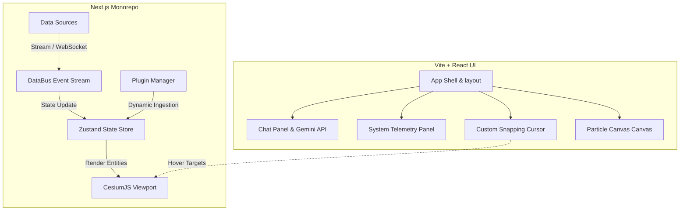

# 🌌 Silver Wolf VI & WorldWideView — Architecture Learning Guide

This document is a human-readable architecture manual designed to help developers and contributors understand how both the **Silver Wolf VI** cyberpunk neural interface and the **WorldWideView** geospatial monorepo work.

---

## 🗺️ High-Level System Architecture

The project consists of two primary systems residing in the same workspace:

1. **Silver Wolf VI** (Vite + React + Tailwind): The user interface shell featuring the Cyberpunk HUD, Gemini AI chat sessions, local history, sound effects, particle fields, and a custom physics-snapping cursor.
2. **WorldWideView** (Next.js 16 monorepo): The geospatial engine that handles real-time streams (like aircraft, satellites, and earthquakes), renders them on a Cesium 3D globe, and handles tenant isolation, plugins, and third-party API integration.



---

## 🎯 1. Custom Snapping Cursor Engine

The custom cursor in Silver Wolf VI is not just a cosmetic visual replacement—it is a physics-simulated snapping engine that pulls the pointer toward active interactive components (like buttons, links, or 3D Cesium entities) when they get close, providing a tactical tactile feel.

### Snapping Cursor Logic (Pseudocode)

```python
# System-level representation of the snapping cursor loop
class SnappingCursor:
    def __init__(self, settings):
        self.mouse_x = 0
        self.mouse_y = 0
        self.cursor_x = 0
        self.cursor_y = 0
        self.velocity_x = 0
        self.velocity_y = 0
        self.active_lock_target = None
        self.settings = settings # includes stiffness, damping, target_radius

    def on_mouse_move(self, event):
        self.mouse_x = event.x
        self.mouse_y = event.y

    def publish_target(self, target):
        # Adds an interactive element bounding box or 3D entity viewport coordinate
        # Targets contain: id, priority, position/rect, explicitLock (forces snapping)
        TargetRegistry.register(target)

    def select_best_target(self):
        # Resolve target based on distance and priority weight
        best_target = None
        highest_score = -99999
        
        for target in TargetRegistry.get_active_targets():
            if target.is_expired():
                TargetRegistry.remove(target)
                continue
                
            distance = calculate_distance(self.cursor_x, self.cursor_y, target.position)
            
            # If target is inside trigger radius
            if distance <= target.trigger_radius or target.explicit_lock:
                score = target.priority * 1.5 - distance * 0.8 + (35 if target.explicit_lock else 0)
                if score > highest_score:
                    highest_score = score
                    best_target = target
                    
        return best_target

    def update_physics(self, delta_time):
        target = self.select_best_target()
        
        if target:
            # Snap pull physics
            target_x = target.position.x
            target_y = target.position.y
            self.active_lock_target = target
        else:
            # Follow mouse physics
            target_x = self.mouse_x
            target_y = self.mouse_y
            self.active_lock_target = None
            
        # Hooke's Law spring calculation: Force = -k * displacement
        displacement_x = target_x - self.cursor_x
        displacement_y = target_y - self.cursor_y
        
        force_x = displacement_x * self.settings.spring_stiffness
        force_y = displacement_y * self.settings.spring_stiffness
        
        # Apply acceleration and damping (friction)
        self.velocity_x = (self.velocity_x + force_x) * self.settings.damping_friction
        self.velocity_y = (self.velocity_y + force_y) * self.settings.damping_friction
        
        # Update coordinate
        self.cursor_x += self.velocity_x * delta_time
        self.cursor_y += self.velocity_y * delta_time

    def render_loop(self, timestamp):
        dt = timestamp - self.last_timestamp
        self.update_physics(dt)
        
        # Render the HTML elements or SVG shapes
        DOM_CursorElement.style.transform = f"translate3d({self.cursor_x}px, {self.cursor_y}px, 0)"
        
        # Draw dynamic UI shapes depending on active profile (e.g., reticle, pixel, arrow)
        self.draw_reticle_shapes(self.active_lock_target)
        requestAnimationFrame(self.render_loop)
```

---

## 📡 2. Real-Time Data Injection Pipeline

WorldWideView uses a lightweight publish-subscribe data bus to stream thousands of geospatial records per second (such as flights, satellites, and maritime data) from external feeds and render them with low memory usage.

### Data Stream Lifecycle (Pseudocode)

```python
# Streaming pipeline: Ingesting to rendering loop
class DataBus:
    def __init__(self):
        self.subscribers = []
        self.event_history = []

    def subscribe(self, callback_func):
        self.subscribers.append(callback_func)

    def publish(self, event_packet):
        # Limit history size to prevent memory leaks
        if len(self.event_history) >= 50:
            self.event_history.pop(0)
        self.event_history.append(event_packet)
        
        # Dispatch to listeners
        for subscriber in self.subscribers:
            subscriber(event_packet)

# Client socket listener handles network updates
class WebSocketClient:
    def __init__(self, server_url):
        self.url = server_url
        self.socket = None

    def connect(self):
        self.socket = new_websocket_connection(self.url)
        self.socket.on_message = self.handle_message

    def handle_message(self, raw_data):
        packet = parse_json(raw_data)
        
        # Hydrate into typed models
        geospatial_record = GeospatialEntity(
            id=packet.id,
            latitude=packet.lat,
            longitude=packet.lon,
            altitude=packet.alt,
            category=packet.type, # e.g. "aviation", "satellite"
            attributes=packet.meta
        )
        
        # Inject to application event bus
        GlobalDataBus.publish(geospatial_record)

# Zustand State Store manages state updates and culling
class ZustandGlobeStore:
    def __init__(self):
        self.entities = Map() # id -> Entity

    def handle_databus_packet(self, entity):
        # Update or add coordinate
        self.entities.set(entity.id, entity)
        
        # Perform boundary check or horizon culling
        if not self.is_in_view_frustum(entity):
            entity.is_visible = False
        else:
            entity.is_visible = True
            
        # Trigger minimal component update
        self.notify_subscribers()

# React Entity Renderer converts states to 3D Canvas primitives
def Entity3DRenderer():
    visible_entities = useZustandStore(lambda s: s.get_visible_entities())
    
    return CesiumBillboardCollection(
        billboards=[
            CesiumBillboard(
                id=item.id,
                position=Cartesian3.fromDegrees(item.longitude, item.latitude, item.altitude),
                image=get_icon_for_category(item.category),
                scale=0.8
            ) for item in visible_entities
        ]
    )
```

---

## 🔌 3. Dynamic Plugin Lifecycle

WorldWideView utilizes a dynamically loaded plugin architecture to keep the base map viewer decoupled from specific domain logic (e.g., flight tracking, earthquakes, ISS paths).

### Plugin Loading Mechanism (Pseudocode)

```python
# Dynamics of loading a third-party plugin bundle safely at runtime
class PluginLoader:
    def __init__(self, plugin_registry_url):
        self.registry_url = plugin_registry_url
        self.loaded_plugins = Map()

    def fetch_manifests(self):
        # Fetch remote configurations and scripts from local or CDN directories
        return HTTP.get(self.registry_url + "/manifests.json")

    def load_plugin(self, manifest):
        plugin_id = manifest.id
        
        if self.loaded_plugins.has(plugin_id):
            return
            
        # Create a sandboxed worker or dynamic script element
        script_element = document.createElement("script")
        script_element.src = manifest.bundle_url
        script_element.type = "module"
        
        script_element.onload = lambda: self.initialize_plugin_globals(plugin_id, manifest)
        document.head.appendChild(script_element)

    def initialize_plugin_globals(self, plugin_id, manifest):
        # Extract global variables exported by the plugin bundle
        plugin_module = window.wwvPluginGlobals[plugin_id]
        
        # Verify credentials & handshake signature
        if not SecurityHandshake.verify(plugin_module.handshake):
            raise SecurityError("Plugin signature invalid.")
            
        # Register the layers into the main layout
        for layer in plugin_module.layers:
            GlobalMapLayerRegistry.add_layer(
                id=layer.id,
                name=layer.name,
                renderer=layer.draw_callback
            )
            
        self.loaded_plugins.set(plugin_id, plugin_module)
        print(f"🔌 Connected and initialized plugin: {manifest.name} (v{manifest.version})")
```
