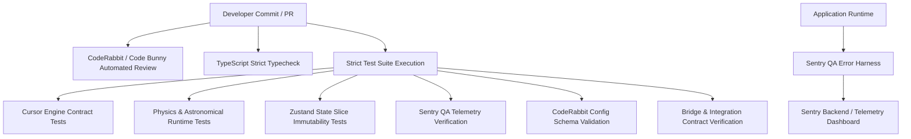

# Silver Wolf VI — QA & Development Architecture

This document describes the Quality Assurance (QA) and Development Architecture for **Silver Wolf VI**, including Sentry telemetry error reporting, CodeRabbit (Code Bunny) automated AI reviews, and the strict test suite harness.

---

## 1. QA Architecture Overview



---

## 2. Sentry QA & Telemetry

Client-side and backend exceptions are captured and instrumented through `sentryQA`:

- **Client-Side Telemetry (`src/core/qa/sentryQA.ts`)**:
  - Automatically captures unhandled exceptions with full stack traces.
  - Maintains a sliding-window buffer of 50 structured breadcrumbs (UI actions, network updates, state mutations).
  - Operates in **Mock/Development Mode** when `SENTRY_DSN` is not provided (ensuring 0 test failures during offline or local test runs).
- **React Error Boundaries (`src/components/common/ErrorBoundary.tsx`)**:
  - React component subtree exceptions are caught gracefully and reported to `sentryQA` with event IDs.
- **Python FastAPI Bridge (`bridge/server.py`)**:
  - Instrumented with `sentry-sdk` for FastAPI/Starlette request trace sampling and error logging.

---

## 3. CodeRabbit (Code Bunny) AI Code Review

Automated pull-request review policies are defined in `.coderabbit.yaml`:

- **Profile**: Assertive QA.
- **Request Changes**: Enabled for policy or test contract violations.
- **Path-Specific Policies**:
  - `src/core/state/**`: Strict Zustand slice isolation & immutability.
  - `src/core/qa/**`: Zero swallowed exceptions & mock mode safety.
  - `src/components/**`: Error boundary wrapping & design token adherence.
  - `bridge/**`: Local-first model prioritization & token efficiency.
  - `scripts/**`: Strict assertion coverage.

---

## 4. Test Commands

Run the test suite using the standard npm scripts:

```bash
# Run all strict contract & unit tests
npm test

# Run strict test suite alias
npm run test:strict

# Run typecheck and full QA verification
npm run qa:check

# Run Vitest test runner
npm run test:vitest
```
