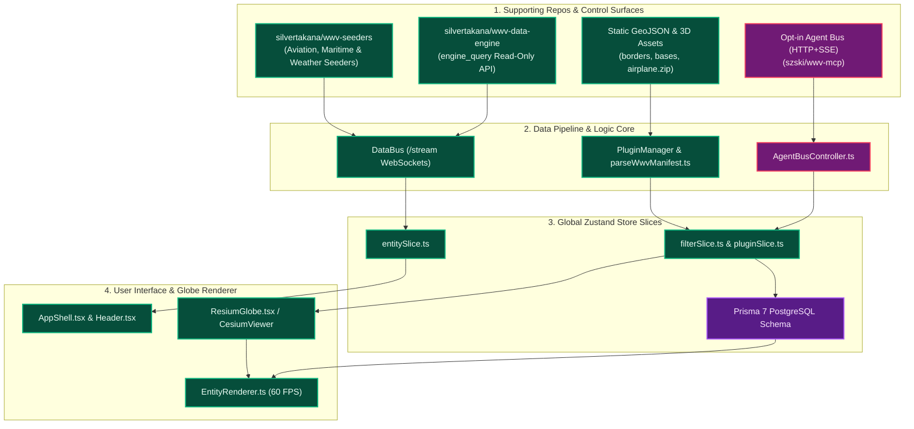

# Comprehensive Dual-Source Application Architecture & Master Integration Plan

This document details the **exhaustive file inventory**, **supporting ecosystem repositories**, **interconnected source architecture diagrams**, **mathematical derivations**, and **execution roadmap** for integrating **WorldWideView (WWV)** (`https://github.com/silvertakana/worldwideview`), **wwv-data-engine** (`https://github.com/silvertakana/wwv-data-engine`), **wwv-seeders** (`https://github.com/silvertakana/wwv-seeders`), and **World Wide Telescope (WWT)** into **Silver Wolf VI**.

---

## 1. Master Architecture & Supporting Ecosystem Repositories

### 1.1 Supporting Repositories Overview
- **WorldWideView Core**: [`https://github.com/silvertakana/worldwideview`](https://github.com/silvertakana/worldwideview) (Next.js 16, Resium/CesiumJS, Agent Bus, Prisma 7).
- **WWV Data Engine**: [`https://github.com/silvertakana/wwv-data-engine`](https://github.com/silvertakana/wwv-data-engine) (Community data backend providing `engine_query` read-only polling APIs for webcams, AIS maritime, and ADS-B aviation).
- **WWV Seeders**: [`https://github.com/silvertakana/wwv-seeders`](https://github.com/silvertakana/wwv-seeders) (Ingestion seeders for streaming live feeds into the WWV `DataBus`).

---

## 2. Source System 1: WorldWideView (WWV) Ecosystem Architecture

### 2.1 Complete WWV File Inventory (Categorized by Architectural Layer)

#### Layer A: Data Ingestion, Backend Seeders & Agent Control
- `silvertakana/wwv-data-engine`: Community data backend (`engine_query` read-only API).
- `silvertakana/wwv-seeders`: Real-time ingestion seeders (Aviation, AIS Maritime, Weather, Webcams).
- `worldwideview/src/core/events/DataBus.ts`: Central typed event bus handling WebSocket `/stream` payload distribution.
- `worldwideview/src/core/agent/AgentBusController.ts`: Opt-in HTTP + SSE control surface for external LLM tools / MCP servers (`szski/wwv-mcp`).
- `worldwideview/src/core/plugins/PluginManager.ts`: Lifecycle manager for dynamic runtime plugin bundle registration.
- `worldwideview/src/core/plugins/parseWwvManifest.ts`: Parser for `data/manifest.json` layer declarations.

#### Layer B: Client State & Zustand Slices (`worldwideview/src/core/state/`)
- `worldwideview/src/core/state/store.ts`: Primary global store initializer.
- `worldwideview/src/core/state/entitySlice.ts`: Live entity state (aircraft, webcams, satellites, bases).
- `worldwideview/src/core/state/filterSlice.ts`: Spatial bounds and temporal query filters.
- `worldwideview/src/core/state/pluginSlice.ts`: Enabled layer toggles and active plugin settings.
- `worldwideview/src/core/state/workspaceSlice.ts`: Multi-tenant workspace configuration state.

#### Layer C: 3D Globe & Spatial Rendering (`worldwideview/src/components/globe/` & `worldwideview/src/core/globe/`)
- `worldwideview/src/components/globe/ResiumGlobe.tsx`: Main Resium + CesiumJS 3D globe component.
- `worldwideview/src/core/globe/EntityRenderer.ts`: 60 FPS entity billboard, polyline, and 3D glTF model batch renderer.
- `worldwideview/src/core/globe/CameraManager.ts`: Globe camera flyTo, altitude tracking, and orientation controller.
- `worldwideview/src/components/panels/ImageryPicker.tsx`: Google Photorealistic 3D Tiles & basemap provider picker.

#### Layer D: Static Assets & Prisma Schema
- `worldwideview/public/borders.geojson` (4.04 MB): International administrative boundary vectors.
- `worldwideview/public/military_bases.geojson` (6.65 MB): Military airbase location markers.
- `worldwideview/public/airplane.zip` (82.1 KB): 3D aircraft glTF model bundle.
- `worldwideview/prisma/schema.prisma`: Prisma 7 PostgreSQL models (`InstalledPlugin`, `Setting`, `Workspace`, `Favorite`).

---

### 2.2 Interconnected WWV Source Architecture Diagram

---

## 3. Master Integration Mapping: Bridging Source Files into Silver Wolf VI

| Source Repository | Source File Path | Integration Adaptation Work | Silver Wolf VI Target File |
|---|---|---|---|
| `wwv-data-engine` | Read-only `engine_query` API | Connect data engine polling feeds | [src/core/state/store.ts](file:///home/admin/Documents/silver-wolf-vi/silver-wolf-vi/src/core/state/store.ts) |
| `wwv-seeders` | Aviation/Maritime Seeders | Ingestion seeder payload mapping | [src/core/plugins/parseWwvManifest.ts](file:///home/admin/Documents/silver-wolf-vi/silver-wolf-vi/src/core/plugins/parseWwvManifest.ts) |
| `worldwideview` | `public/borders.geojson` (4.04 MB) | Local static mirror via build script | [public/wwv-assets/borders.geojson](file:///home/admin/Documents/silver-wolf-vi/silver-wolf-vi/public/wwv-assets/borders.geojson) |
| `worldwideview` | `public/military_bases.geojson` (6.65 MB) | Local static mirror via build script | [public/wwv-assets/military_bases.geojson](file:///home/admin/Documents/silver-wolf-vi/silver-wolf-vi/public/wwv-assets/military_bases.geojson) |
| `worldwideview` | `public/airplane.zip` (82.1 KB) | Local 3D glTF model mirror | [public/wwv-assets/airplane.zip](file:///home/admin/Documents/silver-wolf-vi/silver-wolf-vi/public/wwv-assets/airplane.zip) |
| WWT | Remote WebGL Iframe (`web.wwtassets.org`) | Responsive iframe wrapper & watchdog | [src/components/learning/WorldWideTelescopeView.tsx](file:///home/admin/Documents/silver-wolf-vi/silver-wolf-vi/src/components/learning/WorldWideTelescopeView.tsx) |
| WWT | postMessage Telemetry (`wwt_view_state`) | Mutex lock (`syncSource`) + 32ms throttle | [src/hooks/useWWTListener.ts](file:///home/admin/Documents/silver-wolf-vi/silver-wolf-vi/src/hooks/useWWTListener.ts) |
| WWT | Cesium ECEF Camera Altitude H | Exact horizon FOV: $\text{FOV} = 2 \arcsin\left(\frac{R_E}{R_E + H}\right)$ | [src/hooks/useCameraSync.ts](file:///home/admin/Documents/silver-wolf-vi/silver-wolf-vi/src/hooks/useCameraSync.ts) |
