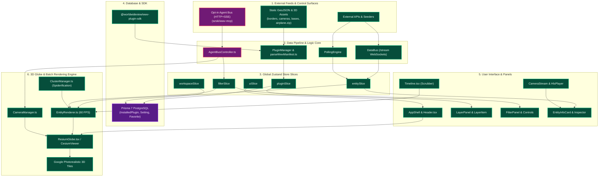
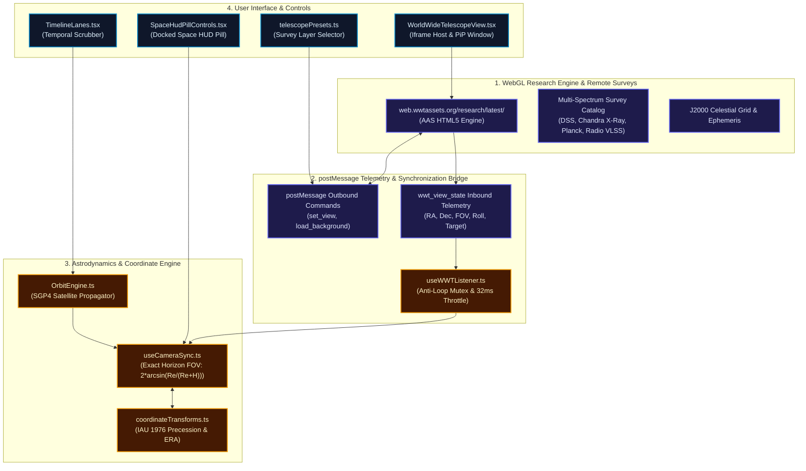

# Comprehensive Dual-Source Application Architecture & Master Integration Plan

This document details the **exhaustive file inventory**, **interconnected source architecture diagrams**, **mathematical derivations**, and **execution roadmap** for integrating **WorldWideView (WWV)** (`https://github.com/silvertakana/worldwideview`) and **World Wide Telescope (WWT)** into **Silver Wolf VI**.

---

## 1. Source System 1: WorldWideView (WWV) Full Architecture

### 1.1 Complete WWV File Inventory (Categorized by Architectural Layer)

#### Layer A: Data Ingestion, WebSocket Bus & Agent Control (`worldwideview/src/core/` & `worldwideview/src/app/api/`)
- `worldwideview/src/core/events/DataBus.ts`: Central typed event bus handling WebSocket `/stream` payload distribution.
- `worldwideview/src/core/agent/AgentBusController.ts`: Opt-in HTTP + SSE control surface for external LLM tools / MCP servers (`szski/wwv-mcp`).
- `worldwideview/src/core/plugins/PluginManager.ts`: Lifecycle manager for dynamic runtime plugin bundle registration.
- `worldwideview/src/core/plugins/pluginStore.ts`: Dynamic plugin configuration and state registry.
- `worldwideview/src/core/engine/PollingEngine.ts`: Seeder updates and periodic REST feed polling orchestrator.
- `worldwideview/src/core/plugins/parseWwvManifest.ts`: Parser for `data/manifest.json` layer declarations.
- `worldwideview/src/app/api/stream/route.ts`: WebSocket streaming server endpoint.
- `worldwideview/src/app/api/agent/mcp/route.ts`: Server-Sent Events (SSE) agent control route.
- `worldwideview/src/app/api/places/search/route.ts` & `details/route.ts`: OpenStreetMap / Nominatim location search API.
- `worldwideview/src/app/api/user/favorites/route.ts`: Favorites CRUD endpoint.
- `worldwideview/src/app/api/v1/entities/search/route.ts` & `region/route.ts`: Spatial entity query endpoints.
- `worldwideview/src/app/api/marketplace/*`: Dynamic plugin marketplace endpoints (`install`, `uninstall`, `enable`, `disable`, `status`, `sideload`, `pkce`, `grant-token`).

#### Layer B: Client State & Zustand Slices (`worldwideview/src/core/state/`)
- `worldwideview/src/core/state/store.ts`: Primary global store initializer.
- `worldwideview/src/core/state/entitySlice.ts`: Live entity state (aircraft, webcams, satellites, bases).
- `worldwideview/src/core/state/filterSlice.ts`: Spatial bounds and temporal query filters.
- `worldwideview/src/core/state/pluginSlice.ts`: Enabled layer toggles and active plugin settings.
- `worldwideview/src/core/state/workspaceSlice.ts`: Multi-tenant workspace configuration state.
- `worldwideview/src/core/state/uiSlice.ts`: Layout state, active panel tabs, drawer open states.

#### Layer C: 3D Globe & Spatial Rendering (`worldwideview/src/components/globe/` & `worldwideview/src/core/globe/`)
- `worldwideview/src/components/globe/ResiumGlobe.tsx`: Main Resium + CesiumJS 3D globe component.
- `worldwideview/src/core/globe/EntityRenderer.ts`: 60 FPS entity billboard, polyline, and 3D glTF model batch renderer.
- `worldwideview/src/core/globe/CameraManager.ts`: Globe camera flyTo, altitude tracking, and orientation controller.
- `worldwideview/src/core/globe/ClusterManager.ts`: Entity spatial clustering, culling, and 3D spiderification.
- `worldwideview/src/components/panels/ImageryPicker.tsx`: Google Photorealistic 3D Tiles & basemap provider picker.

#### Layer D: UI Components & Layout Overlays (`worldwideview/src/components/`)
- `worldwideview/src/components/layout/AppShell.tsx`: Desktop application shell layout.
- `worldwideview/src/components/layout/Header.tsx` & `SearchBar.tsx`: Top workspace navigation bar & search field.
- `worldwideview/src/components/layout/MobileHudBar.tsx` & `PanelToggleArrows.tsx`: HUD overlays.
- `worldwideview/src/components/panels/LayerPanel.tsx` & `LayerItem.tsx`: Interactive layer tree controller.
- `worldwideview/src/components/panels/FilterPanel.tsx` & `FilterControls.tsx`: Filter controls panel.
- `worldwideview/src/components/panels/EntityInfoCard.tsx` & `DynamicPropertiesRender.tsx`: Entity property inspector.
- `worldwideview/src/components/panels/FavoritesTab.tsx` & `PluginsTab.tsx`: User saved bookmarks & marketplace UI.
- `worldwideview/src/components/panels/MarketplaceConnect.tsx`: Plugin authorization window.
- `worldwideview/src/components/timeline/Timeline.tsx`: Temporal timeline scrubber.
- `worldwideview/src/components/video/CameraStream.tsx`, `HlsPlayer.tsx`, `FloatingVideoManager.tsx`: Live webcam streams.

#### Layer E: Static Assets (`worldwideview/public/`)
- `worldwideview/public/borders.geojson` (4.04 MB): International administrative vector boundaries.
- `worldwideview/public/cameras_geojson.json` (1.93 MB): Global webcam location features.
- `worldwideview/public/public-cameras.json` (1.81 MB): Public webcam metadata index.
- `worldwideview/public/military_bases.geojson` (6.65 MB): Military base and airbase location vectors.
- `worldwideview/public/airplane.zip` (82.1 KB): 3D aircraft glTF model archive.
- `worldwideview/public/plane-icon.svg` & `military-plane-icon.svg`: Aviation billboard SVG icons.
- `worldwideview/public/data/satellites.json`: TLE satellite orbital catalog dataset.

#### Layer F: Database Schema & Monorepo SDK (`worldwideview/prisma/` & `worldwideview/packages/`)
- `worldwideview/prisma/schema.prisma`: Prisma 7 PostgreSQL schema defining `InstalledPlugin`, `Setting`, `Workspace`, `WorkspaceMember`, `Favorite`, `MarketplaceCredential`.
- `worldwideview/packages/wwv-plugin-sdk/`: `@worldwideview/wwv-plugin-sdk` monorepo package for dynamic plugins.

---

### 1.2 Interconnected WWV Source Architecture Diagram

---

## 2. Source System 2: World Wide Telescope (WWT) Full Architecture

### 2.1 Complete WWT Integration File Inventory

#### Layer A: WebGL Engine & Iframe Host Container
- `src/components/learning/WorldWideTelescopeView.tsx`: Main React component hosting the WWT WebGL iframe (`web.wwtassets.org`), managing window bounds, picture-in-picture (PiP) mode, watchdog timers, and tabbed control drawers.
- `web.wwtassets.org/research/latest/`: HTML5 WebGL Research Engine entrypoint.

#### Layer B: Multi-Spectrum Celestial Surveys & Catalog Mappers
- `src/data/telescopePresets.ts`: Deep-sky survey catalog file defining astronomical survey layers:
  - **DSS Color Visible**: Digitized Sky Survey optical visible light all-sky mosaic.
  - **Chandra X-Ray**: High-energy X-ray observatory space survey.
  - **Planck Dust & Gas**: Far-infrared cosmic microwave background survey.
  - **Radio VLSS**: Very Large Array Low-Frequency Sky Survey.
  - **3D Solar System Ephemeris**: J2000 celestial reference grid and planetary orbital paths.
- `src/hooks/cesium/useTelescopePresets.ts`: React hook managing survey selection state and layer payload dispatch.

#### Layer C: Telemetry Listener & Event Communication Protocol
- `src/hooks/useWWTListener.ts`: Event listener hook capturing `wwt_view_state` postMessage broadcasts from WWT iframe, extracting camera parameters ($\text{RA } \alpha, \text{Dec } \delta, \text{FOV}, \text{Roll}, \text{Target}$), protected by an anti-loop Mutex (`syncSource`) and 32ms (~30 FPS) throttle timer.

#### Layer D: Astrodynamics & Coordinate Conversion Matrices
- `src/hooks/useCameraSync.ts`: Camera sync engine executing bidirectional orientation sync between Cesium ECEF globe coordinates and WWT J2000 celestial equatorial coordinates. Implements exact spherical horizon FOV formula:
  $$\text{FOV}(H) = 2 \arcsin\left(\frac{R_E}{R_E + H}\right)$$
- `src/lib/coordinateTransforms.ts`: Celestial coordinate transformation library:
  - `precessEquatorialJ2000ToDate`: IAU 1976 Precession matrix transform.
  - `getEarthRotationAngle`: IAU 2000 Earth Rotation Angle (ERA) sidereal time solver.
  - `ecefToRaDec`: 3D ECEF position vector to Right Ascension ($\alpha$) and Declination ($\delta$) solver.
- `src/core/satellites/OrbitEngine.ts`: SGP4 orbital propagation solver for satellite trajectory propagation.

#### Layer E: User Interface Overlays & Control Controls
- `src/components/panels/SpaceHudPillControls.tsx`: Space HUD control strip docked beneath top mode switcher (NAV, LAYERS, North Reset, Terrain, Borders, Roads, Trails, Ruler, Reload).
- `src/components/learning/TimelineLanes.tsx`: Multi-lane temporal scrubber governing system `currentTime`, `playbackSpeed`, and real-time SGP4 orbital simulation playback.

---

### 2.2 Interconnected WWT Source Architecture Diagram

---

## 3. Master Integration Mapping: Bridging Source Files into Silver Wolf VI

| Source Repository | Source File Path | Integration Adaptation Work | Silver Wolf VI Target File |
|---|---|---|---|
| WWV | `worldwideview/public/borders.geojson` (4.04 MB) | Local static mirror via build script | [public/wwv-assets/borders.geojson](file:///home/admin/Documents/silver-wolf-vi/silver-wolf-vi/public/wwv-assets/borders.geojson) |
| WWV | `worldwideview/public/cameras_geojson.json` (1.93 MB) | Local static mirror via build script | [public/wwv-assets/cameras_geojson.json](file:///home/admin/Documents/silver-wolf-vi/silver-wolf-vi/public/wwv-assets/cameras_geojson.json) |
| WWV | `worldwideview/public/public-cameras.json` (1.81 MB) | Local static mirror via build script | [public/wwv-assets/public-cameras.json](file:///home/admin/Documents/silver-wolf-vi/silver-wolf-vi/public/wwv-assets/public-cameras.json) |
| WWV | `worldwideview/public/military_bases.geojson` (6.65 MB) | Local static mirror via build script | [public/wwv-assets/military_bases.geojson](file:///home/admin/Documents/silver-wolf-vi/silver-wolf-vi/public/wwv-assets/military_bases.geojson) |
| WWV | `worldwideview/public/airplane.zip` (82.1 KB) | Local 3D glTF model mirror | [public/wwv-assets/airplane.zip](file:///home/admin/Documents/silver-wolf-vi/silver-wolf-vi/public/wwv-assets/airplane.zip) |
| WWV | `worldwideview/public/plane-icon.svg` & military icon | Local SVG icon mirror | [public/wwv-assets/plane-icon.svg](file:///home/admin/Documents/silver-wolf-vi/silver-wolf-vi/public/wwv-assets/plane-icon.svg) |
| WWV | Asset Resolver (`worldwideview`) | Add `getWwtAssetLocalCandidateUrls` local-first check | [src/lib/wwt/repositoryData.ts](file:///home/admin/Documents/silver-wolf-vi/silver-wolf-vi/src/lib/wwt/repositoryData.ts) |
| WWV | Dynamic Layer Manifests | Wire `loadFromManifest()` layer initialization | [src/core/plugins/parseWwvManifest.ts](file:///home/admin/Documents/silver-wolf-vi/silver-wolf-vi/src/core/plugins/parseWwvManifest.ts) |
| WWV | Zustand Stores (`entitySlice`, `filterSlice`) | Define clear boundary between UI store & domain store | [src/store/uiStore.ts](file:///home/admin/Documents/silver-wolf-vi/silver-wolf-vi/src/store/uiStore.ts) / [src/core/state/store.ts](file:///home/admin/Documents/silver-wolf-vi/silver-wolf-vi/src/core/state/store.ts) |
| WWV | Static Ground Features | Apply `HeightReference.CLAMP_TO_GROUND` clamping | [src/hooks/cesium/useLandmarks.ts](file:///home/admin/Documents/silver-wolf-vi/silver-wolf-vi/src/hooks/cesium/useLandmarks.ts) |
| WWV | Prisma 7 Schema & Agent Bus | `schema.prisma` models (`InstalledPlugin`, `Setting`, `Favorite`) | [worldwideview/prisma/schema.prisma](file:///home/admin/Documents/silver-wolf-vi/silver-wolf-vi/worldwideview/prisma/schema.prisma) |
| WWT | Remote WebGL Iframe (`web.wwtassets.org`) | Responsive iframe wrapper, PiP bounds clamp, watchdog | [src/components/learning/WorldWideTelescopeView.tsx](file:///home/admin/Documents/silver-wolf-vi/silver-wolf-vi/src/components/learning/WorldWideTelescopeView.tsx) |
| WWT | All-Sky Surveys (DSS, Chandra, Planck, Radio) | Catalog array mapping & layer selection dispatch | [src/data/telescopePresets.ts](file:///home/admin/Documents/silver-wolf-vi/silver-wolf-vi/src/data/telescopePresets.ts) |
| WWT | postMessage Telemetry (`wwt_view_state`) | Mutex lock (`syncSource`) + 32ms (~30 FPS) throttle timer | [src/hooks/useWWTListener.ts](file:///home/admin/Documents/silver-wolf-vi/silver-wolf-vi/src/hooks/useWWTListener.ts) |
| WWT | Cesium ECEF Camera Altitude H | Exact horizon FOV: $\text{FOV} = 2 \arcsin\left(\frac{R_E}{R_E + H}\right)$ | [src/hooks/useCameraSync.ts](file:///home/admin/Documents/silver-wolf-vi/silver-wolf-vi/src/hooks/useCameraSync.ts) |
| WWT | Celestial J2000 Coordinates | IAU 1976 Precession & Earth Rotation Angle (ERA) matrices | [src/lib/coordinateTransforms.ts](file:///home/admin/Documents/silver-wolf-vi/silver-wolf-vi/src/lib/coordinateTransforms.ts) |
| WWT | Space HUD Controls | Docked pill strip beneath mode switcher pill | [src/components/panels/SpaceHudPillControls.tsx](file:///home/admin/Documents/silver-wolf-vi/silver-wolf-vi/src/components/panels/SpaceHudPillControls.tsx) |
| WWT | Temporal Timeline Scrubbing | Link `currentTime` scrubbing to SGP4 orbital propagation | [src/components/learning/TimelineLanes.tsx](file:///home/admin/Documents/silver-wolf-vi/silver-wolf-vi/src/components/learning/TimelineLanes.tsx) / [src/core/satellites/OrbitEngine.ts](file:///home/admin/Documents/silver-wolf-vi/silver-wolf-vi/src/core/satellites/OrbitEngine.ts) |
