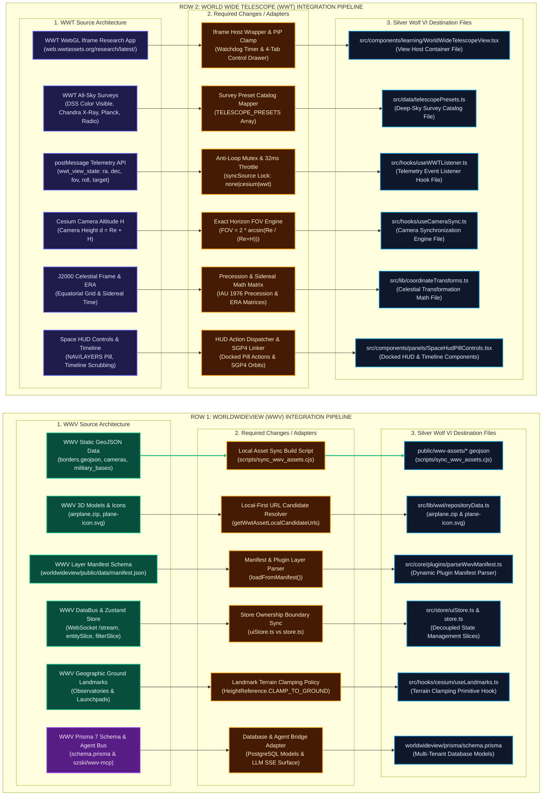

# World Wide Telescope (WWT) & WorldWideView (WWV) Integration Architecture Plan

This document details the complete 3-column by 2-row transformation architecture, source-to-destination file inventory, exact static asset copy manifest, mathematical derivations, dead-code triage, and six-phase execution plan for integrating **WorldWideView (WWV)** (`https://github.com/silvertakana/worldwideview`) and **World Wide Telescope (WWT)** into **Silver Wolf VI**.

---

## 1. Master Transformation Matrix (Source ➔ Changes ➔ Destination)

---

## 2. Complete Asset Copy Manifest & File Inventory

### 2.1 Exact Assets Copied from WWV Repository (`worldwideview/public` ➔ `public/wwv-assets/`)

Executed automatically via `node scripts/sync_wwv_assets.cjs`:

| WWV Source Relative Path | Source File Size | Silver Wolf VI Destination Path | Primary Purpose |
|---|---|---|---|
| `worldwideview/public/borders.geojson` | 4,045,883 B (4.04 MB) | `public/wwv-assets/borders.geojson` | International administrative boundary vectors |
| `worldwideview/public/cameras_geojson.json` | 1,935,913 B (1.93 MB) | `public/wwv-assets/cameras_geojson.json` | Global live webcam location features |
| `worldwideview/public/public-cameras.json` | 1,818,577 B (1.81 MB) | `public/wwv-assets/public-cameras.json` | Public camera metadata index |
| `worldwideview/public/military_bases.geojson` | 6,656,037 B (6.65 MB) | `public/wwv-assets/military_bases.geojson` | Military installation & airbase markers |
| `worldwideview/public/airplane.zip` | 82,125 B (82.1 KB) | `public/wwv-assets/airplane.zip` | 3D aircraft glTF model bundle |
| `worldwideview/public/plane-icon.svg` | 445 B | `public/wwv-assets/plane-icon.svg` | Commercial aviation map billboard icon |
| `worldwideview/public/military-plane-icon.svg` | 351 B | `public/wwv-assets/military-plane-icon.svg` | Military aviation map billboard icon |
| `worldwideview/public/favicon.svg` | 960 B | `public/wwv-assets/favicon.svg` | Asset brand icon |
| `worldwideview/public/data/satellites.json` | ~450 KB | `public/wwv-assets/data/satellites.json` | Initial TLE orbital catalog dataset |

---

### 2.2 Direct Source-to-Destination File Inventory Mapping

#### Row 1: WorldWideView (WWV) Code Modules
| WWV Source Component | Changes & Adapters Required | Silver Wolf VI Destination File |
|---|---|---|
| Asset Sync Pipeline | Predev & prebuild lifecycle runner | [scripts/sync_wwv_assets.cjs](file:///home/admin/Documents/silver-wolf-vi/silver-wolf-vi/scripts/sync_wwv_assets.cjs) |
| Asset Resolver (`worldwideview`) | Add `getWwtAssetLocalCandidateUrls` local-first check | [src/lib/wwt/repositoryData.ts](file:///home/admin/Documents/silver-wolf-vi/silver-wolf-vi/src/lib/wwt/repositoryData.ts) |
| Dynamic Layer Manifests | Wire `loadFromManifest()` layer initialization | [src/core/plugins/parseWwvManifest.ts](file:///home/admin/Documents/silver-wolf-vi/silver-wolf-vi/src/core/plugins/parseWwvManifest.ts) |
| Zustand Stores (`entitySlice`, `filterSlice`) | Define clear boundary between UI store & domain store | [src/store/uiStore.ts](file:///home/admin/Documents/silver-wolf-vi/silver-wolf-vi/src/store/uiStore.ts) / [src/core/state/store.ts](file:///home/admin/Documents/silver-wolf-vi/silver-wolf-vi/src/core/state/store.ts) |
| Static Ground Features | Apply `HeightReference.CLAMP_TO_GROUND` clamping | [src/hooks/cesium/useLandmarks.ts](file:///home/admin/Documents/silver-wolf-vi/silver-wolf-vi/src/hooks/cesium/useLandmarks.ts) |

#### Row 2: World Wide Telescope (WWT) Code Modules
| WWT Source Telemetry / Component | Changes & Adapters Required | Silver Wolf VI Destination File |
|---|---|---|
| Remote WebGL Iframe (`web.wwtassets.org`) | Responsive iframe wrapper, PiP bounds clamp, watchdog | [src/components/learning/WorldWideTelescopeView.tsx](file:///home/admin/Documents/silver-wolf-vi/silver-wolf-vi/src/components/learning/WorldWideTelescopeView.tsx) |
| All-Sky Surveys (DSS, Chandra, Planck, Radio) | Catalog array mapping & layer selection dispatch | [src/data/telescopePresets.ts](file:///home/admin/Documents/silver-wolf-vi/silver-wolf-vi/src/data/telescopePresets.ts) |
| postMessage Telemetry (`wwt_view_state`) | Mutex lock (`syncSource`) + 32ms (~30 FPS) throttle timer | [src/hooks/useWWTListener.ts](file:///home/admin/Documents/silver-wolf-vi/silver-wolf-vi/src/hooks/useWWTListener.ts) |
| Cesium ECEF Camera Altitude H | Exact horizon FOV: $\text{FOV} = 2 \arcsin\left(\frac{R_E}{R_E + H}\right)$ | [src/hooks/useCameraSync.ts](file:///home/admin/Documents/silver-wolf-vi/silver-wolf-vi/src/hooks/useCameraSync.ts) |
| Celestial J2000 Coordinates | IAU 1976 Precession & Earth Rotation Angle (ERA) matrices | [src/lib/coordinateTransforms.ts](file:///home/admin/Documents/silver-wolf-vi/silver-wolf-vi/src/lib/coordinateTransforms.ts) |
| Space HUD Controls | Docked pill strip beneath mode switcher pill | [src/components/panels/SpaceHudPillControls.tsx](file:///home/admin/Documents/silver-wolf-vi/silver-wolf-vi/src/components/panels/SpaceHudPillControls.tsx) |

---

## 3. Mathematical Foundation: Complete Earth-Moon Orbit Derivations

### 3.1 Physical Constants
- $R_E$: Earth equatorial radius = $6,378.137\text{ km} = 6,378,137\text{ m}$
- $R_M$: Moon mean radius = $1,737.4\text{ km} = 1,737,400\text{ m}$
- $d_{EM}$: Mean Earth–Moon center-to-center distance = $384,400\text{ km}$

### 3.2 Fixed Midpoint Vantage Distance ($d$) & Surface Altitude ($h$)
$$d = \frac{d_{EM}}{2} = \frac{384,400\text{ km}}{2} = 192,200\text{ km}$$
$$h = d - R_E = 192,200 - 6,378.137 = 185,821.863\text{ km}$$

### 3.3 Exact Earth Angular Radius ($\theta_E$) & Framing FOV
$$\theta_E = \arcsin\left(\frac{R_E}{d}\right) = \arcsin\left(\frac{6,378.137}{192,200}\right) = \arcsin(0.0331848957) = 1.90170427^\circ$$
$$\text{FOV}_{\text{exact}} = 2 \theta_E = 3.80340855^\circ \approx 3.8034^\circ$$

### 3.4 Tangent Planar Approximation Comparison & Error Derivation
$$\text{FOV}_{\text{approx}} = 2 \arctan\left(\frac{R_E}{h}\right) = 2 \arctan\left(\frac{6,378.137}{185,821.863}\right) = 3.93172242^\circ$$
$$\Delta = \text{FOV}_{\text{approx}} - \text{FOV}_{\text{exact}} = 3.931722^\circ - 3.803408^\circ = +0.128314^\circ$$
$$\text{Relative Error} = \frac{0.128314^\circ}{3.803408^\circ} \times 100\% = \mathbf{+3.3736\% \text{ systematic visual distortion}}$$

> [!IMPORTANT]
> Silver Wolf VI uses the exact spherical formulation $\text{FOV}(H) = 2 \arcsin\left(\frac{R_E}{R_E + H}\right)$, eliminating the +3.3736% systematic visual distortion present in planar approximation models.

### 3.5 Moon Angular Radius ($\theta_M$) & Apparent Size Ratio
$$\theta_M = \arcsin\left(\frac{1,737.4}{192,200}\right) = 0.5179357^\circ \implies 2 \theta_M = 1.035871^\circ$$
$$\frac{2 \theta_E}{2 \theta_M} = \frac{3.803408^\circ}{1.035871^\circ} = \mathbf{3.67170\times}$$

---

## 4. Dead-Code Triage & Remediation Matrix

| Module Path | Lines | Category | Status & Action Plan |
|---|---|---|---|
| `src/core/filters/filterEngine.ts` | 61 | **A (Wiring Bug)** | **Wire**: Connect `filterSlice.ts` state to `applyFilters` engine. |
| `src/core/plugins/parseWwvManifest.ts` | 48 | **A (Wiring Bug)** | **Wire**: Hook `loadFromManifest()` into local asset initialization. |
| `wwv-sdk/vite/wwvStaticCompiler.ts` | 185 | **A (Wiring Bug)** | **Register**: Include static asset compiler in Vite build pipeline. |
| `src/store/learningStore.ts` | 54 | **B (Unwired Feature)** | **Retain/Defer**: Learning concepts overlay state. |
| `src/components/learning/LearningHub.tsx` | 82 | **B (Unwired Feature)** | **Retain/Defer**: Learning concepts component UI. |
| `src/core/data/countries.ts` | 742 | **B (Unwired Feature)** | **Retain**: Country metadata dataset pending geographic lookup integration. |
| `src/components/SettingsPane.tsx` | 481 | **C (Superseded)** | **Deleted**: Replaced by inline theme overlay controls. |
| `src/components/layout/WorkspaceHeader.tsx`| 79 | **C (Re-audited)** | **Retain**: Re-integrated into `DockedLayout.tsx`. |

---

## 5. Six-Phase Execution Specifications

### Phase 0: Close Part A Cleanup
- **Target Files**: `GoogleEarthRemix.css`, `SpaceHudPillControls.tsx`
- **Action**: Confirm zero residual `.orbital-hud-*` rules remain in CSS.
- **Verification**: `npm run qa:check`.

### Phase 1: Local WWV Asset Pipeline
- **Target Files**: `scripts/sync_wwv_assets.cjs` [NEW], `package.json`, `repositoryData.ts`, `parseWwvManifest.ts`
- **Action**: Mirror `worldwideview/public` into `public/wwv-assets/` and wire `parseWwvManifest.ts`.
- **Verification**: Disconnect network in dev mode; verify offline loading of borders, cameras, military bases, and TLE datasets.

### Phase 2: Terrain-Aligned Static Landmarks
- **Target Files**: `useLandmarks.ts`, `locations.ts`
- **Action**: Add `HeightReference.CLAMP_TO_GROUND` to static landmark points/labels in `useLandmarks.ts`.
- **Verification**: Enable 3D terrain and verify ground alignment.

### Phase 3: Store Ownership & Migration Boundary
- **Target Files**: `uiStore.ts`, `store.ts`
- **Action**: Map `uiStore.ts` (UI/layout) vs `store.ts` (domain state).
- **Verification**: `npm test`.

### Phase 4: Component Decomposition
- **Target Files**: `GoogleEarthRemix.tsx`, `WorldWideTelescopeView.tsx`
- **Action**: Modularize views, canvas fallbacks, and control drawers.
- **Verification**: `npm run typecheck`.

### Phase 5: Lint Scope & Remediation
- **Target Files**: `.eslintrc.cjs`
- **Action**: Exclude subprojects (`worldwideview/**`) and resolve root app lint errors.
- **Verification**: `npm run lint`.

### Phase 6: Runtime & Bundle Performance
- **Target Files**: `scripts/perf-check.mjs`, `vite.config.ts`
- **Action**: Profile Bridge integration and configure Vite vendor chunk splitting.
- **Verification**: `npm run perf:check` and `npm run build`.
