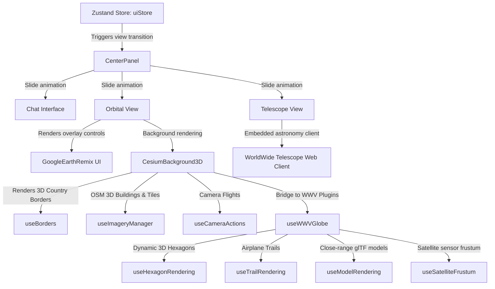

# Silver Wolf VI - Operator & Developer Manual
## Premium AI-Spatial Cybernetic Workspace

Welcome to the **Silver Wolf VI** Operator and Developer Manual. This document serves as the comprehensive repository of knowledge for the design, architecture, reverse engineering, and day-to-day operation of the Silver Wolf VI spatial dashboard.

---

## 1. Concept & Visual Aesthetics
Silver Wolf VI is modeled as a premium, AI-native cybernetic workstation. The visual design is heavily inspired by **Honkai: Star Rail** (specifically the character Silver Wolf's hacking aesthetic) and features a high-density, neon-cyberpunk user interface.

### Design Elements
- **Color Palette:** Tailored deep space gradients, cool cyan highlights (`#00FFFF`), and Honkai-inspired purples (`#8A5BC7`).
- **Glassmorphism:** Translucent panel backdrops with dynamic blur (`backdrop-filter: blur(16px)`), solid/glow borders, and customizable card opacity.
- **Dynamic Animations:** Micro-animations for buttons, breathing glow pulses for active operations, and smooth slide-in/out transitions between primary views.
- **Atmospheric Rendering:** Real-time day/night sunlight cycle, glowing atmospheric horizons, and dynamic starfields.

---

## 2. System Architecture

Silver Wolf VI integrates a three-way space-shell workspace:



### Key Technical Subsystems:
1. **Zustand State Store (`uiStore.ts`):** Coordinates primary view mode switching (`chat` vs `orbital` vs `telescope`), panel expansions, graphics settings (borders, terrain, shadows, resolution scale, anti-aliasing), panel transition styles (`slide`, `swing-3d`, `fade`), and active selections.
2. **Cesium 3D Globe Viewer (`CesiumBackground3D.tsx`):** Renders the WGS84 planetary base layer using WebGL2. 
3. **WorldWide Telescope Viewport (`WorldWideTelescopeView.tsx`):** Embeds the astronomical WWT client via deep-linked coordinates and a glass-morphic controller.
4. **DataBus Event Pipeline (`DataBus.ts`):** Allows loose coupling between plugins, UI buttons, and Cesium camera animations via publish/subscribe event channels (e.g., `cameraGoTo`, `cameraFaceTowards`).
5. **WWV Plugin Ingestion SDK (`wwv-sdk/`):** Standardizes real-time entity streams (such as USGS Earthquakes and ISS tracking telemetry) for automatic rendering.

---

## 3. Project Timelines & Prompt Evolution
Silver Wolf VI evolved through a sequence of design and engineering iterations:

1. **Phase 1: Foundation & Theming:** Initial layout creation for a three-panel dashboard adopting a cyberpunk theme.
2. **Phase 2: Fallback 2D Globe & Physics:** Creation of the canvas 2D vector fallback globe to run physics calculations and trajectory rendering without WebGL dependencies.
3. **Phase 3: WorldwideView SDK Integration:** Translation of the WorldWideView (WWV) plugin SDK to support ingestion pipelines (planes, satellites, earthquakes) inside the React stack.
4. **Phase 4: Optimization & LOD:** Implementing level-of-detail rendering for close-range glTF models (like airplanes) and camera-altitude-based dynamic clustering to preserve thread performance.
5. **Phase 5: Orbital View & Features Activation:** Renaming the layout to **Orbital View**, centering and raising the mode switcher (`z-30`), removing meridian/parallel lines to clear CRT scanlines, and wiring the borders, imagery, trails, satellite sensor cones, and 3D hexagonal seismic markers.
6. **Phase 6: Celestial Telescope Integration & Transition Dynamics:** Integrating the WorldWide Telescope (WWT) web client as a dedicated "Telescope View" in the mode switcher, featuring pre-loaded coordinates for nebulae and planets. Implementing customizable 3D swinging and fading side panel transitions under personalization settings, and resolving OSM fallback layer runtime issues to ensure robust offline/default rendering.

---

## 4. Operator Guide (How to Use)

### Primary View Selection
Toggle between **Chat View** (to prompt your AI companion), **Orbital View** (to inspect the 3D globe), and **Telescope View** (to point the celestial array) using the capsule-shaped switcher pill centered at the very top of the center panel.

### Navigation & Camera Controls
- **Rotate Globe:** Left-click and drag the globe to turn it.
- **Tilt Camera:** Right-click/middle-click and drag, or hold `Ctrl` + drag, to tilt and change pitch/yaw.
- **Zoom In/Out:** Use the scroll wheel or the floating `+` and `-` buttons in the bottom-right control cluster.
- **Reset Heading (North up):** Click the Compass button to orient North to the top.
- **Recenter:** Click the navigation chevron icon to return the camera focus to the active target.

### Search Panel
Search for static cities, monuments, or active entities (like the ISS) in the Left Sidebar's Search input. Clicking a result will lock the target and fly the camera smoothly to its position.

### Graphics Presets
Open the Left Sidebar's **Map Style** (layers) tab to control visual details:
- **Performance Mode:** Minimizes graphics for low-end systems (disables shadows/MSAA, lowers resolution scale to 0.7x, hides 3D buildings).
- **Cinematic Mode:** Maximizes graphics for high-end systems (enables shadows, 1.0x resolution scale, MSAA 4x, and load 3D OSM buildings).

### Measurement Ruler
Use the **Measure** tool in the Left Sidebar to compute the geodetic distance (great-circle path) between a Start and End landmark. The path will be drawn as a blue geodetic line.

### Telescope View (WorldWide Telescope Array)
Point the workspace array at deep space objects or planets using the **Telescope** switcher tab:
- **Navigation:** Click and drag the viewport to pan the celestial sphere; use the scroll wheel to zoom.
- **Star Array Presets:** Point the telescope instantly at preloaded cosmic structures:
  - *Deep Sky Survey:* Comprehensive panoramic sky map.
  - *Andromeda Galaxy (M31):* Fly to the closest major spiral galaxy.
  - *Orion Nebula (M42):* Zoom in on active stellar nurseries.
  - *Pillars of Creation (M16):* Luminous gas pillars imaged by Hubble and JWST.
  - *Crab Nebula (M1):* High-detail supernova remnant.
  - *Planet Mars / Jupiter:* Rotate orthographic surface scans and orbital paths of Solar System targets.
- **Telemetry Indicators:** Monitor real-time Right Ascension (RA), Declination (DEC), and Field of View (FOV) on the glass-morphic controller panel.

---

## 5. Developer Guide (Reverse Engineering)

### Directory Map
- `src/components/panels/CenterPanel.tsx`: Orchestrates the slide transitions between the Chat view container and the Orbital view container.
- `src/components/background/CesiumBackground3D.tsx`: Spawns the Cesium canvas and wires up hooks.
- `src/core/globe/hooks/useHexagonRendering.ts`: Custom hook drawing 3D hexagons for earthquakes.
- `src/core/globe/hooks/useSatelliteFrustum.ts`: Renders the conical frustum under selected satellites.
- `src/core/globe/useBorders.ts`: Batches country boundaries into a single WebGL primitive draw call to maintain high frame rates.
- `src/plugins/earthquakes/EarthquakesPlugin.ts`: Ingests USGS feeds and maps magnitude to proportional 3D hexagon geometries.

### Creating a Custom Ingestion Plugin
To add a new data layer, create a class implementing the `WorldPlugin` interface:
```typescript
import type { WorldPlugin, GeoEntity, CesiumEntityOptions } from "@/core/plugins/PluginTypes";

export class CustomSatelitePlugin implements WorldPlugin {
    readonly id = "my-custom-plugin";
    readonly name = "Custom Satellites";
    readonly version = "1.0.0";

    async fetch(): Promise<GeoEntity[]> {
        // Fetch and map your custom API data to WGS84 coordinates
        return [{
            id: "sat-1",
            pluginId: this.id,
            latitude: 37.7749,
            longitude: -122.4194,
            altitude: 350000,
            timestamp: new Date(),
            properties: { speed: 7.8 }
        }];
    }

    renderEntity(entity: GeoEntity): CesiumEntityOptions {
        return {
            type: "model",
            modelUrl: "/satellite/scene.gltf",
            modelScale: 2.0,
            labelText: "Custom Sat-1"
        };
    }
}
```

---

## 6. Workspace Artifact Gallery

Below are visual captures of the system's operational interface states:


*Figure 1: Cyberpunk Workspace Panel Layout*


*Figure 2: Cesium 3D Globe with Atmosphere Lighting*


*Figure 3: Global Earthquake Magnitude Columns*
